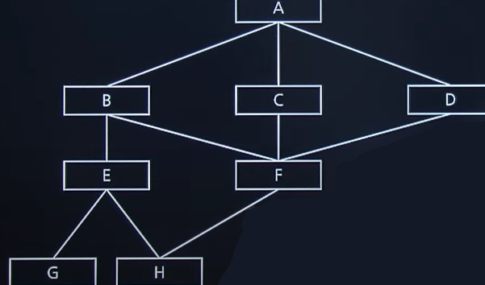

# 2020 실기 1차

## 1. 데이터베이스 모델링 과정 중 비정규화(Denormalization, 반정규화, 역정규화)의 개념을 간략히 서술하시오.

정답 : 데이터베이스 정규화 이후, **성능향상**과 **개발 편의성** 등 정규화 기법에 위배되는 수행 기법

<hr>

## 2. 다음 설명에 부합하는 마크업 언어는 무엇인지 영문 약어로 쓰시오.

<pre>
- (   )은 SGML의 단순화된 부분집합으로, 다른 많은 종류의 데이터를 기술하는 데 사용할 수 있다.
- (   )은 주로 다른 종류의 시스템,  특히 인터넷에 연결된 시스템끼리 데이터를 쉽게 주고 받을 수 있게 하여 HTML의 한계를 극복할 목적으로 만들어졌다.
- (   )은 텍스트 데이터 형식으로 유니코드를 사용해 전 세계 언어를 지원한다.
</pre>

정답 : XML

<hr>

## 3. 소프트웨어 테스트 방법의 원리 중 하나인 살충제 패러독스(Pesticide Paradox)의 개념을 간략히 설명하시오.

정답 : 동일한 테스트로 동일한 절차를 반복 수행하면 새로운 결함을 찾을 수 없다.

<hr>

## 4. 프로그램 모듈화와 모듈의 독립성에 대한 설명이다. 아래 ①, ②에 해당하는 용어를 쓰시오

<pre>
- 모듈의 독립성을 판단하는 두 가지 지표이다. (①)는 모듈과 모듈간의 상호 의존 정도, (②)는 모듈 내부의 기능적인 집중 정도이다.
- 모듈의 독립성을 높이기 위해서는 모듈 간의 상호 의존 정도를 나타내는 (①)를 낮추고 모듈이 독립적으로 자체 기능만을 수행하도록 (②)를 높여야 한다.
</pre>

정답 : ① 결합도, ② 응집도

<hr>

## 5. 다음은 어떤 프로그램의 구조를 나타낸다.<br> Fan-in의 수가 2 이상인 모듈의 이름을 쓰시오.



정답 : F, H

<hr>

## 6. 다음 설명 중 빈 칸에 가장 부합하는 용어를 영문약어로 쓰시오.

<pre>
- Javascript 객체 문법으로 구조화된 데이터를 표현하기 위한 문자 기반의 표준 포맷.
- (   )표현식은 사람과 기계 모두 이해하기 쉬우며 용량이 작아서 최근에는 (   )이 XML을 대체해서 데이터 전송 등에 많이 사용한다.
- 프로그래밍 문법이 아닌 단순히 데이터를 표시하는 표현 방법일 뿐이다.
- (   )데이터는 이름과 값의 쌍으로 이루어진다.
</pre>

정답 : JSON

<hr>

## 7. 다음 설명 중 빈 칸 ①~③에 가장 부합하는 애플리케이션 성능 측정을 위한 지표를 쓰시오

<pre>
- ( ① ) : 일정 시간 내에 애플리케이션이 처리하는 일의 양
- ( ② ) : 애플리케이션에 요청을 전달한 시간부터 응답이 도착할 때까지 걸린 시간
- ( ③ ) : 애플리케이션에 요청을 전달한 시간부터 처리가 완료될 때까지 걸린 시간
- 자원 사용률(Resource Usage) : 애플리케이션이 작업을 처리하는 동안의 CPU 사용량, 메모리 사용량, 네트워크 사용량 등 자원 사용률
</pre>

정답 :

① : 처리량(Throughput)

② : 응답 시간(Response Time)

③ : 경과 시간(Turn Around Time)

<hr>

## 8. 학생(STUDENT) 테이블과 전자과 학생 50명, 전기과 학생 100명, 건축과 학생 50명의 정보가 저장되어 있을 때, 다음 ①~③ SQL문의 실행 결과 튜플 수를 쓰시오. (단, DEPT 컬럼은 학과명이다.)

<pre>
① SELECT DEPT FROM STUDENT;
② SELECT DISTINCT DEPT FROM STUDENT;
③ SELECT COUNT(DISTINCT DEPT) FROM STUDENT WHERE DEPT = "건축과";
</pre>

정답 :

① : 200

② : 3

③ : 1

<hr>

## 9. 다음에 가장 부합하는 네트워크 공격 유형을 쓰시오.

<pre>
- 출발지 IP와 목적지 IP가 같은 패킷을 만들어 보내는 공격 방법
- 수신자가 응답을 보낼 때, 목적지 주소가 자기 자신이므로 SYN 신호가 계속 자신의 서버를 돌게 되어 서버의 자원을 고갈시켜 가용성을 파괴한다.
- 방화벽에서 출발지와 목적지가 같은 패킷은 모두 제거하여 대응한다.
</pre>

정답 : Land Attack

<hr>

## 10. 통신 프로토콜 또는 통신 규약은 컴퓨터나 원거리 통신 장비 사이에서 메시지를 주고 받는 양식과 규칙의 체계이다. 통신 프로토콜의 기본 요소 3가지를 쓰시오

정답 : 구문(Syntax), 의미(Semantic), 타이밍(Timing)

<hr>

## 11. HRN(Highest Response-ratio Next) 우선순위를 결정하는 계산식을 쓰시오

정답 : (대기시간 + 서비스시간) / 서비스시간

<hr>

## 12. 다음은 트랙잭션(Transaction)의 주요 특성 4가지이다.<br>빈 칸①~②에 알맞은 용어를 쓰시오

|        |                                                                                                                             |
| ------ | --------------------------------------------------------------------------------------------------------------------------- |
| (①)    | 트랜잭션의 가장 기본적인 특성으로 트랜잭션 내의 연산은 반드시 모두 수행되어야 하며 그렇지 못한 경우 모두 수행되지 않아야 함 |
| 일관성 | 트랜잭션이 정상적으로 완료된 후 언제나 일관성 있는 데이터베이스 상태가 되어야 하며, 결과에 모순이 생겨서는 안 됨            |
| (②)    | 하나의 트랜잭션이 수행 중에는 다른 트랜잭션이 접근할 수 없고 각각의 트랜잭션은 독립적이어야 함                              |
| 영속성 | 지속성이라고도 하며, 트랜잭션이 성공적으로 완료된 후 결과는 지속적으로 유지되어야 함                                        |

정답 :

① : 원자성

② : 독립성

<hr>

## 13. OSI7 참조 모델 중 다음이 설명하는 계층을 쓰시오

<pre>
- 전기적, 기계적, 기능적인 특성을 이용해서 통신 케이블로 데이터를 전송
- 통신 단위는 비트이며 이것은 1과 0으로 나타내어지는 즉, 전기적으로 On, Off 상태이다.
- 데이터를 전달할 뿐, 데이터가 무엇인지 어떤 에러가 있는지 신경쓰지 않는다.
</pre>

정답 : 물리 계층

<hr>

## 14. 릴리즈 노트 작성 항목 중 문서 이름(릴리스 노트 이름), 제품 이름, 버전 번호, 릴리즈 날짜, 참고 날짜, 노트 버전 등을 기술하는 작성 항목은 무엇인지 쓰시오.

정답 : 헤더

<hr>

## 15. 데이터 마이닝(Data mining)의 개념을 간략히 서술하시오.

정답 :

- 대규모로 저장된 데이터 안에서 체계적이고 자동적으로 통계적 규칙이나 패턴을 찾아내는 것
- **수많은 데이터**에서 가치 있는 **유용한 정보**를 찾아내는 것

<hr>

## 16. 1990년 R.Rivert가 MD4를 일방향 해시 함수로 개선한 알고리즘으로, 임의의 길이의 값을 입력받아서 128비트 길이의 해시값을 출력하는 알고리즘은 무엇인지 쓰시오.

정답 : MD5

- 부가설명 : 최근에는 MD5가 아닌 SHA를 많이 사용함(SHA1 ...2 등)

<hr>

## 17. LOC 기법에 의하여 예측된 총 라인 수가 30,000라인일 경우 개발에 투입될 프로그래머의 수가 5명이고, 프로그래머들의 평균 생산성이 월당 300라인일 때, 개발에 소요되는 기간을 구하는 계산식과 기간(개월)을 구하여 쓰시오

정답 : 30000 / 300 / 5 = 20(개월)

<hr>

## 18. 다음은 C언어로 작성된 프로그램이다. 이를 실행한 결과를 쓰시오.

```C

int a[] = {95, 75, 85, 100, 50}
int i, j, temp;
int n = sizeof(a) / sizeof(int); //
int n = 5;

for(i = 0; i < n - 1; i++){
    for(j = 0; j < 4 - i; j++){
        if (a[j] > a[j + 1]) {
            temp = a[j];
            a[j] = a[j + 1];
            a[j + 1] = temp;
        }
    }
}

for(i = 0; i < 5; i++) {
    printf("%d", a[i])
}

```

정답 : 50 75 85 95 100

<hr>

## 19. 다음은 JAVA로 작성된 프로그램이다. 이를 실행한 결과를 쓰시오.

```java

public static int[] makeArray(int n) {
    int[] t = new int[n];
    for(int i = 0; i < n; i++){
        t[i] = i;
    }
    return t;
}

public static void main(String[] args) {
    int[] a = makeArray(4);
    for(int i = 0; i < a.length; i++) {
        System.out.print(a[i] + " ");
    }
}

```

정답 : 0 1 2 3

<hr>

## 20. 다음은 JAVA로 작성된 프로그램이다. 이를 실행한 결과를 쓰시오.

```java

int i = 3, c = 1;

switch(i) {
    case 1: c++;
    case 2: c += 3;
    case 3: c = 0;
    case 4: c += 3;
    case 5: c -= 10;
    default: c--;

}

System.out.print(c);

```

정답 : -8 (브레이크가 없기 때문에 case3부터 default까지 수행한다.)
