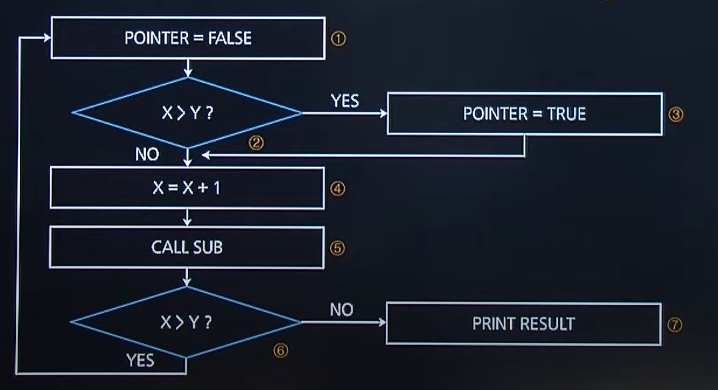

# 2020 실기 3차

## 1. 형상 통제에 대해 간략히 설명하시오

정답 : 소프트웨어 형상변경 요청을 검토하고 승인하여 현재의 베이스라인에 반영될 수 있도록 통제

형상 변경 요청 -> 검토 -> 승인 -> 통제

<hr>

## 2. 다음은 EAI 구축 유형에 대한 설명이다. ①, ②에 해당하는 유형을 쓰시오

| 유형 |                                                                        설명                                                                        |
| :--: | :------------------------------------------------------------------------------------------------------------------------------------------------: |
| (①)  |    - 중간에 미들웨어를 두지 않고 각 애플리케이션 간 직접 연결<br>솔루션 구매 없이 통합, 상대적으로 저렴하게 통합 가능<br>- 변경, 재사용 어려움     |
| (②)  | - 단일 접점이 허브 시스템을 통해 데이터를 전송하는 중앙 집중적 방식<br>- 모든 데이터 전송 보장, 확장 및 유지 보수 용이<br>- 허브 장애 시 전체 영향 |

정답 :

① : point to point

② : hub & spoke

<hr>

## 3. UI(User Interface) 설계 원칙 중 직관성에 대해 간략히 서술하시오

정답 : 누구나 쉽게 이해하고 사용할 수 있어야 한다. 사용자가 기능을 쉽게 파악할 수 있도록 해야 한다.

<hr>

## 4. 다음 제어 흐름 그래프에 대한 분기 커버리지(Branch Coverage)를 수행하는 경우의 테스트 케이스 경로를 7단계와 6단계로 나눠서 순서대로 나열하시오.



정답 :

1 -> 2 -> 3 -> 4 -> 5 -> 6 -> 1

1 -> 2 -> 4 -> 5 -> 6 -> 7

<hr>

## 5. 소프트웨어 테스트 기법 중 소프트웨어의 기능이 완전히 작동하는 것을 입증하는 테스트로, 동치분할/경계값 분석을 이용하여 테스트하는 기법을 쓰시오.

정답 : 블랙박스 테스트

<hr>

## 6. <학생> 테이블에 '주소' 컬럼을 추가하는 SQL 문을 완성하는 빈 칸 ①~②에 알맞은 예약어를 쓰시오.

```SQL
( ① ) TABLE 학생 ( ② ) 주소 VARCHAR(20)
```

정답 :

① : ALTER

② : ADD

<hr>

## 7. <성적> 테이블을 대상으로 아래 <요구사항>을 적용하여 결과를 출력하는 SQL문을 작성하시오.

<성적 테이블>

| 학번 | 과목번호 |   과목이름   | 학점 | 점수 |
| :--: | :------: | :----------: | :--: | :--: |
| A100 |   101    | 데이터베이스 |  A   |  95  |
| A100 |   101    |   자료구조   |  B   |  80  |
| A100 |   101    | 데이터베이스 |  A   |  99  |
| A100 |   101    |   자료구조   |  B   |  88  |
| A100 |   101    |   자료구조   |  C   |  79  |

<pre>
<div align="center"><요구사항></div>
1. <성적> 테이블에서 과목별 평균 점수가 90점 이상인 과목이름, 최소점수, 최대점수를 출력하시오.
2. WHERE 구분은 하지 않는다.
3. GROUP BY, HAVING을 이용한다.
4. 최소점수, 최대 점수 별칭을 위해 AS문을 이용한다.
5. 명령문의 종결 문자인 세미콜론(;)은 생략 가능합니다.
</pre>

정답 :

SELECT 과목이름, MIN(점수) AS 최소점수, MAX(점수) AS 최대점수 FROM 성적

GROUP BY 과목이름

HAVING AVG(점수) >= 90

<hr>

## 8. <학생> 테이블에서 이름이 '민수'인 학생 튜플을 삭제하는 SQL문을 작성하시오.<br>(단, 다음의 요구사항을 참고하여 작성하시오.)

<pre>
<div align="center"><요구사항></div>
1. 이름 속성의 데이터는 문자형이다. 문자형 데이터는 작은따옴표('')로 표시하시오.
2. SQL 명령문은 대/소문자를 구분하지 않는다.
3. SQL 명령문의 종결 문자인 세미콜론(;)은 생략 가능합니다.
</pre>

정답 : DELETE FROM 학생 WHERE 이름 = '민수';

<hr>

## 9. 데이터베이스 스키마(Schema)에 대해 간략히 서술하시오.

정답 : **데이터베이스의 전체적인 구조와 제약조건**에 대한 명세를 기술하고 정의한 것이다.

<hr>

## 10. 다음에서 설명하는 관계 대수 연산의 기호를 쓰시오.

<pre>
릴레이션 A에서 릴레이션 B의 모든 조건을 만족하는 튜플을 제외한 후 프로젝션하는 연산자이다.
</pre>

정답 : ÷(DIVISION - 나누기 연산자)

<hr>

## 11. 다음 설명에 해당하는 라우팅 프로토콜을 쓰시오.

<pre>
- 최단 경로 탐색에 다익스트라 알고리즘 기반 방식 사용
- 최적 경로 선택을 위해 홉수, 대역폭, 지연시간 등을 고려
- 링크상태 변화시에만 라우팅정보 전송
</pre>

정답 : OSPF(Open Shortest Path First)

<hr>

## 12. 인터넷 프로토콜의 비신뢰적인 특성을 보완하기 위한 프로토콜로 IP 패킷 전송 중 에러 발생 시 에러 발생 원인을 알려주거나 네트워크 상태를 진단해주는 기능을 제공하는 프로토콜을 무엇이라고 하는지 영문 약어로 쓰시오.

정답 : ICMP

<hr>

## 13. 헝가리안 표기법에 대해 간략히 설명하시오.

정답 : 변수 선언 시 변수 앞에 데이터의 타입을 명시하는 표기법

EX. var StrName = "some name"

(현업에서 안쓴다.)

<hr>

## 14. 리팩토링(Refactoring)의 목적에 대해 간략히 설명하시오

정답 : 결과의 변경 없이 코드의 구조를 재조정한다. (성능향상, 가독성 키워드 필수)

코드의 기능을 유지한 채 성능과 가독성을 향상시키기 위해 실시하는 것

<hr>

## 15. 빈 칸에 공통으로 들어갈 가장 적합한 용어를 쓰시오.

<pre>
심리학자 톰 마릴은 컴퓨터가 메시지를 전달하고, 메시지가 제대로 도착했는지 확인하며, 도착하지 않았을 경우 메시지를 재전송하는 일련의 방법을 가리켜 '기술적 은어'라는 뜻으로 (   )(이)라 불렀다.
</pre>

정답 : 프로토콜

<hr>

## 16. 다음은 C언어로 작성된 프로그램이다. 이를 실행한 출력 결과를 쓰시오.

```C
void main() {
    int i = 0, c = 0;
    while (i < 10) {
        i++;
        c *= i;
    }
    printf("%d", c);
}
```

정답 : 0

<hr>

## 17. 다음은 C언어로 작성된 프로그램이다. 이를 실행한 출력 결과를 쓰시오.

```c
int r1() {
    return 4
}
int r10() {
    return (30 + r1());
}
int r100() {
    return (200 + r10());
}
void main() {
    printf("%d", r100())
}

```

정답 : 234

<hr>

## 18. 다음은 JAVA로 작성된 프로그램이다. 이를 실행한 출력 결과를 쓰시오.

```java

public static void main(String[] args) {
    int i = 0;
    int sum = 0;
    while(i < 10) {
        i++;
        if(i%2 == 1)
            continue;
        sum += i;
    }
    System.out.print(sum);
}

```

정답 : 30

<hr>

## 19. 다음은 JAVA로 작성된 프로그램이다. 이를 실행한 출력 결과를 쓰시오

```java

abstract class Vehicle {
    String name;
    public Vehicle(String val) {
        this.name = val;
    }
    public String getName() {
        return "Vehicle name:" + name;
    }
}


class Car extends Vehicle {
    private String name;
    public Car(String val) {
        name = super.name = val;
    }
    public String getName(String val) {
        return "Car name:" + val
    }
    public String getName(byte val[]) {
        return "Car name:" + val;
    }
}

Vehicle obj = new Car("Spark");
System.out.println(obj.getName());

```

정답 : Vehicle name:Spark

Vehicle과 Car의 getName 메서드는 받는 인자가 다르기 때문에 오버로딩의 개념이다.

때문에 출력 시 사용되는 obj.getName()은 인자가 없기 때문에 Vehicle의 getName 메서드를 사용하게 된다.

하지만 Vehicle 클래스를 통해 상속되었기 때문에 Vehicle 내의 메서드만 사용할 수 있다.

obj.getName("a") 같이 사용한다면 에러가 발생된다.

<hr>

## 20. C++에서 생성자(Constructor)에 대해 간략히 설명하시오.

정답 : 생성자는 객체 생성 시 자동으로 호출되는 메서드로, 멤버를 초기화하는 목적으로 주로 사용된다.
