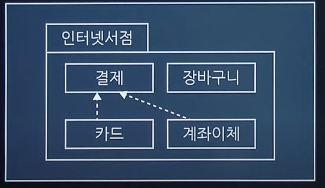
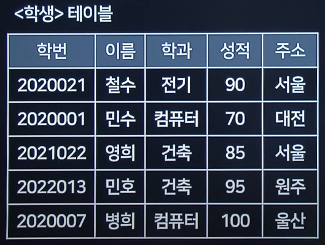
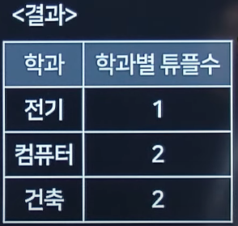
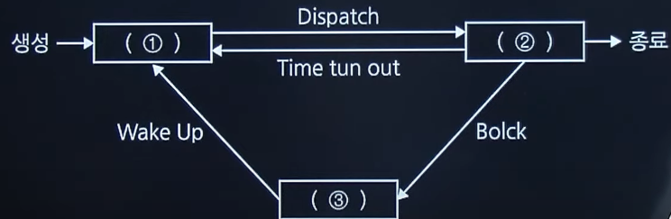

# 2020 실기 4차

## 1. 다음은 디자인 패턴에 대한 설명이다. 빈 칸 안에 들어갈 가장 적합한 용어를 쓰시오.

```
- 디자인 패턴은 객체 지향 프로그래밍 설계를 할 때 자주 발생하는 문제들에 대해 재사용할 수 있도록 만들어놓은 패턴들의 모음이다.
- 에리히 감마(Erich Gamma), 리차드 헬름(Richard Helm), 랄프 존슨(Ralph Johnson), 존 블리시디스(John Vissides)에 의해 개발 영역에서 디자인 패턴을 구체화하고 체계화시켰다.
- goF의 디자인 패턴은 생성, 구조, (   )의 3 가지로 분류한다.
```

정답 : 행위

<hr>

## 2. UML을 이용한 다이어그램 중 아래 그림에 해당하는 다이어그램을 쓰시오



정답 : 패키지 다이어그램

<hr>

## 3. 일반, 업무용, 게임, 오락 등의 일반적인 업무에 사용하는 테스트 오라클로 특정한 몇 개의 입력 값에 대해서만 기대하는 결과를 제공해주는 오라클을 쓰시오.

정답 : 샘플링 오라클

<hr>

## 4. 테스트 기법 중 다음과 같이 입력값을 넣고, 출력값을 비교하는 테스트 기법을 쓰시오

| 테스트케이스 |   1    |    2    |    3    |    4     |
| :----------: | :----: | :-----: | :-----: | :------: |
|     구간     | 0 ~ 59 | 60 ~ 79 | 80 ~ 89 | 90 ~ 100 |
| 테스트데이터 |   45   |   70    |   80    |    95    |
|    예측값    |   F    |    C    |    B    |    A     |
|    결과값    |   F    |    C    |    B    |    A     |

정답 : 동등분할 테스트

<hr>

## 5. <학생> 테이블을 대상으로 <요구사항>을 적용하여 아래 <결과>와 같이 출력하는 SQL 문을 작성하시오.





<pre>
<div align="center"><요구사항></div>
1. WHERE 구문을 사용하지 않고 SQL문을 작성하시오.
2. GROUP BY 구문과 집계함수를 반드시 사용하여 SQL문을 작성하시오.
3. 인용 문구를 사용 시 작은따옴표('') 사용 가능합니다.
4. AS 구문은 반드시 사용하여 작성하시오
</pre>

정답 :

SELECT 학과, COUNT(\*) AS 학과별튜플수
FROM 학생
GROUP BY 학과

<hr>

## 6. 스니핑(Sniffing)에 대하여 간략히 서술하시오.

정답 : 네트워크상에 통과되는 **패킷들의 내용을 엿보는** 행위이다.

<hr>

## 7. 정보보안의 3요소 중 가용성에 대해서 서술하시오.

정답 : 인가된 사용자가 정보를 요구할 때 적시에 제공되어야 하는 원칙

<hr>

## 8. 데이터베이스의 이상(Anomaly)의 종류 3가지를 쓰시오.

정답 : 삽입이상, 삭제이상, 갱신이상.

<hr>

## 9. 데이터베이스 회복 기법에 관련된 설명에서 괄호에 들어갈 가장 알맞은 용어를 쓰시오

```
다양한 데이터 회복 기법 중 (   ) 회복 기법은 로그를 이용한 회복 기법으로 데이터베이스에 대한 갱신 로그를 저장함으로서 회복에 대비한다.

(   ) 회복 기법은 트랜잭션이 실행 상태에서 변경되는 내용을 그때그때 바로 데이터베이스에 적용하는 기법이다.

(   ) 회복 기법은 장애가 발생하면 로그 파일에 기록된 내용을 참조하여, 장애 발생 시점에 따라 Redo나 Undo를 실행하여 데이터베이스를 복구한다.
```

정답 : 즉시갱신

<hr>

## 10. 다음 프로세스 상태 전이도의 빈 칸 ①~③에 알맞은 프로세스 상태를 각각 쓰시오.



정답 :

① : 준비

② : 실행

③ : 대기

<hr>

## 11. 다음 설명에 설명하는 용어를 쓰시오.

```
- IPv4의 주소 고갈 문제를 해결하기 위하여 기존의 IPv4주소 체계를 128비트 크기로 확장한 차세대 인터넷 프로토콜 주소
- 헤더의 내용을 확인하는데 소요되는 오버헤드를 최소화하도록 설계
- 16비트씩 8부분, 128비트로 구성되며, 콜론(:)으로 구분한다.
- 주소 분류로, 유니캐스트, 멀티캐스트, 애니캐스트를 사용한다.

```

정답 : IPv6

<hr>

## 12. 다음 설명에 해당하는 운영체제를 적으시오.

- 1960년대 말 벨 연구소(Bell Labs)에서 개발된 운영체제로 다중 사용자, 멀티태스킹 운영체제이다.
- 대부분 C언어로 작성되어 있어 이식성이 높다.
- 트리구조의 파일 시스템을 갖는다.

정답 : 유닉스(UNIX)

<hr>

## 13. 다음 설명에 해당하는 용어를 쓰시오.

```

- 정형 데이터 및 사진 영상 등의 비정형 데이터를 효과적으로 처리하는 오픈소스 빅데이터 솔루션이다.
- 많은 양의 데이터를 여러 대의 범용 컴퓨터에 나눠서 저장해주고 처리한다.
- 더그 커팅과 마이크 캐퍼랠라가 개발했으며, 구글의 맵리듀스(MapReduce) 엔진을 사용한다.

```

정답 : 하둡(Hadoop)

<hr>

## 14. 다음 설명에 해당하는 용어를 쓰시오

<pre>
관리 대상 데이터를 '블록'이라고 하는 소규모 데이터들이 P2P 방식을 기반으로 생성된 체인 형태의 연결고리 기반 분산 데이터 저장 환경에 저장하여 누구라도 임의로 수정할 수 없고 누구나 변경의 결과를 열람할 수 있는 분산 컴퓨팅 기술 기반의 원장 관리 기술
</pre>

정답 : 블록체인

<hr>

## 15. 다음 설명하는 용어를 쓰시오

```
- 우리나라 말로 번역하면 '네트워크 주소 변환'이라는 의미
- 내부에서 사용하는 사설 IP 주소와 외부로 보여지는 공인 IP 주소 간의 IP Address 변환 방식을 말한다
- 한정된 공인 IP를 여러 개의 내부 사설 IP로 변환하기 위해 사용하는 기술
```

정답 : NAT(Network Address Translation)

<hr>

## 16. 다음은 C언어로 작성된 프로그램이다.<br>이를 실행한 출력 결과를 쓰시오.

```c

void main(){
    char *p = "KOREA";
    printf("%s\n", p);
    printf("%s\n", p + 3);
    printf("%c\n", *p);
    printf("%c\n", *(p + 3));
    printf("%c\n", *p + 2);

}

```

정답 :

KOREA (변수 p는 KOREA)

EA (변수 p의 +3번째 인덱스부터 출력하면 EA)

K (\*p의 값 K)

E (p+3의 포인터값 E)

M (\*p의 값에 2를 더한 %c는 아스키코드에 의해 K(+0) L(+1) M(+2) 즉 M)

<hr>

## 17. 다음 JAVA 프로그램을 분석하여 빈 칸 ①~⑩에 들어갈 내용을 각각 쓰시오.

```java

public static void main(String[] args) {
    int[][] arry = new int[①][②];
    for(int i = 0; i < 3; i++){
        for(int j = 0; j < 5; j++){
            arry[i][j] = j * 3 + (i + 1);
            System.out.print(arry[i][j] + "");
        }
        System.out.println();
    }
}

```

정답 :

① : 3

② : 5

<hr>

## 18. 아래 <처리결과>처럼 10진수를 2진수로 변환해주는 프로그램이다.<br>JAVA 프로그램의 빈 칸 ①~②에 들어갈 JAVA 구문을 쓰시오

<처리결과>

00001010

```java

int a[] = new int[8]
int i = 0, n = 10;
while ( ① ) {
    a[i++] = ②;
    n /= 2;
}
for(i = 7; i >= 0; i--)
    System.out.printf("%d", a[i])

```

정답 :

① : i < a.length(length를 사용하라는 지문이 없는 경우 8로 써도 무관)

② : n % 2

<hr>

## 19. 다음은 JAVA로 작성된 프로그램이다. 이를 실행한 출력 결과를 쓰시오.

```java

class parent {
    int com(int num) {
        if(num <= 1)
            return num;
        return com(num - 1) + com(num - 2);
    }
}

class Child extends Parent {
    int com(int num) {
        if(num <= 1)
             return num;
        return com(num - 1) + com(num - 3);
    }
}


Parent obj = new Child();
System.out.print(obj.compute(4))


```

정답 : 1

Parent에서 정의된 com을 Child에서 com으로 재정의 했기 때문에 메서드 오버라이딩이다. 때문에 obj.compute는 Child의 com 메서드를 사용해야 한다.

<hr>

## 20. 다음은 Python 언어로 작성된 프로그램이다.<br>이를 실행한 출력 결과를 쓰시오.

```python

lol = [[1, 2, 3], [4, 5], [6, 7, 8, 9]]

print(lol[0])
print(lol[2][1])
for sub in lol:
    for item in sub:
        print(item, end=" ")
    print()


```

정답 :

[1, 2, 3]

7

1 2 3

4 5

6 7 8 9
