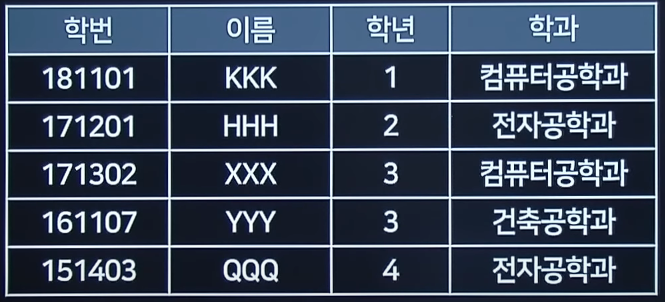

# 2021 실기 1차

## 1. 물리주소 (MAC Address)를 IP 주소로 변화하는 프로토콜을 작성하시오.

정답 : RARP(Reverse Address Resolution Protocol, 역순 주소 결정 프로토콜)

<hr>

## 2. 빈 칸 ①~③에 해당하는 용어를 쓰시오.

<pre>
( ① ) : 현실 세계에 있는 그대로 사람이 이해할 수 있는 형태의 정보구조로 만들어가는 과정을 의미하기 때문에 정보 모델이라고 한다.
( ② ) : 추출된 엔티티와 속성들의 관계를 구조적으로 정의하는 단계로, ①에서 만들어진 구조를 컴퓨터가 이해하고 처리할 수 있도록 변환하는 과정
( ③ ) : 실제 저장장치에 어떻게 저장할지 설계하는 단계
</pre>

정답 :

① : 개념적 설계

② : 논리적 설계

③ : 물리적 설계

<hr>

## 3. 다음 테이블의 카디널리티와 차수를 구하시오.



차수 : 4

카디널리티 : 5

<hr>

## 4. 기업 내부에서 운영되는 각종 플랫폼 및 애플리케이션 간의 정보전달, 연계, 통합을 가능하게 하는 솔루션이다. Point to Point, Hub & Spoke, Message Bus, Hybrid 형태로 구성된다.

EAI(Enterprise Architecture Integration)

<hr>

## 5. 다음 <보기>에 해당하는 데이터 모델 구성 3요소 중 ①, ②에 알맞은 데이터 모델 구성 요소를 쓰시오.

<pre>
- ( ① ) : 데이터베이스에 저장된 실제 데이터를 처리하는 작업에 대한 명세로 데이터베이스를 조작하는 도구이다.
- ( ② ) : 논리적으로 표현된 개체 타입들 간의 관계로서 데이터 구조 및 정적 성질을 표현한다.
- 제약조건 : 데이터베이스에 저장될 수 있는 실제 데이터의 논리적인 제약 조건

</pre>

정답 :

① : 연산

② : 구조

<hr>

## 6. 다음은 블랙박스 테스트의 예시이다. ①, ⑪에 알맞은 테스트를 작성하시오.

```
- ( ① ) : 0 <= X <= 10 일 때, -1, 0, 10, 11인 경우 사용하는 테스트
- ( ② ) : 유효값과 그렇지 않은 범위를 나눠야 할 경우 사용하는 테스트
```

정답 :

① : 경계값 분석

② : 동등분할 테스트

<hr>

## 7. 괄호 안에 공통적으로 들어갈 공격 기법을 쓰시오

<pre>
(   )은 시스템 간 연결이 활성화된 상태, 즉 로그인(Login) 된 상태를 가로채는 것을 뜻한다.
(   )은 TCP의 고유한 취약점을 이용해 정상적인 접속을 빼앗는 방법이다.
서버와 클라이언트 통신 시 TCP의 시퀀스 넘버를 제어하는데 발생하는 문제를 공격한다.
TCP는 클라이언트와 서버 간 통신을 할 때 패킷의 연속성을 보장하기 위해 각각 시퀀스 넘버를 사용한다. 이 시퀀스 넘버가 잘못되면 이를 바로잡기 위한 작업을 하는데, (   )은 서버와 클라이언트에 각각 잘못된 시퀀스 넘버를 위조해서 연결된 세션에 잠시 혼란을 준 뒤 자신이 끼어들어가는 방식이다.
</pre>

정답 : 세션 하이재킹

<hr>

## 8. 다음 ①, ②에 알맞은 답안을 작성하시오.

```
IPv6는 ( ① )비트의 길이를 가진다.
IPv4는 길이가 32비트이며, ( ② ) 비트씩 4분할한다.
```

정답 :

① : 128

② : 8

<hr>

## 9. 다음 ①~③에서 설명하는 결합도를 작성하시오.

```
- ( ① ) : 두 모듈이 동일한 자료구조를 조회하는 경우
- ( ② ) : 가장 강한 결합도를 가지고 있으며, 한 모듈이 다른 모듈의 내부 기능 및 그 내부 자료를 조회하도록 설계되었을 경우
- ( ③ ) : 여러 모듈이 공통 자료 영역을 사용하는 경우
```

정답 :

① : 스탬프 결합도

② : 내용 결합도

③ : 공통 경합도

<hr>

## 10. <보기>에 해당하는 용어를 쓰시오.

```
- ( ① ) : 요구사항은 제품을 구현하기 위해 소프트웨어가 가져야할 기능적 속성
- ( ② ) : 요구사항은 제품 품질 기준 등의 만족을 위해 소프트웨어가 가져야 할 특성

```

정답 :

① : 기능적

② : 비기능적

<hr>

## 11. 시스템 객체의 접근을 개인 또는 그룹의 식별자에 기반한 방법으로 어떤 종류의 접근 권한을 가진 사용자가 다른 사용자에게 자신의 판단에 따라 권한을 허용하는 접근제어 방식은?

정답 : DAC(Discretionary Access Control - 임의적 접근 통제)

<hr>

## 12. 웹 서비스의 구체적 내용이 기술되어 있어 서비스 제공 장소, 서비스 메시지 포맷, 프로토콜 등이 기술되어 있는 언어는?

정답 : WSDL(Web Service Description Language)

<hr>

## 13. <보기>에 해당하는 용어를 쓰시오

```
- ( ① ) : 개발자가 원시 코드를 대상으로 다른 부분과 연계되는 부분은 고려하지 않고, 각각의 단위 자체에만 집중하여 테스트한다.
- ( ② ) : 인터페이스 간 시스템이 정상적으로 실행되는지 확인하는 테스트이다.

```

정답 :

① : 단위 테스트

② : 통합 테스트

<hr>

## 14. 시스템의 성능 향상, 개발 과정의 편의성 등을 위해 정규화된 데이터 모델을 분할, 통합, 추가하는 과정으로, 의도적으로 정규화에 위배되는 행위이다.<br>무엇을 설명하는 것인지 쓰시오

정답 : 반정규화

<hr>

## 15. 실행 프로세스 간에 통신을 가능하게 하는 기술로, 종류에는 파이프, 메시지 큐, 공유 메모리, 세마포어, 소켓 등이 있다.

정답 : IPC(Inter-Process Communication)

<hr>

## 16. 다음 SQL 문의 실행결과를 쓰시오

```sql
SELECT COUNT(*) FROM TABLE01
WHERE EMPNO > 100
AND SAL >= 3000
OR EMPNO = 200

```

| EMPNO | SAL  |
| ----- | ---- |
| 100   | 1000 |
| 200   | 3000 |
| 300   | 1500 |

정답 :

1

<hr>

## 17. 다음 파이썬 프로그램의 실행결과를 쓰시오

```python

class arr:
    a = ["Seoul", "Kyeonggi", "Incheon", "Daejeon", "Daegu", "Pusan"]
str = ''
for i in arr.a:
    str = str + i[0]
print(str)

```

정답 :

SKIDDP

<hr>

## 18. 다음 JAVA 프로그램의 실행결과를 쓰시오.

```java
int i, sum;
for(i = 0; i <= 5; i++) {
    sum += i;
    System.out.print(i);
    if( i == 5) {
        System.out.print("=");
        System.out.print(sum);
    }
    else {
        System.out.print("+")
    }
}

```

정답 :

0+1+2+3+4+5=15

<hr>

## 19. 다음 JAVA 프로그램의 실행결과를 쓰시오.

```java

int val[][] = { {45, 50, 75}, {89}};
System.out.println(val[0].length)
System.out.println(val[1].length)
System.out.println(val[0][0])
System.out.println(val[0][1])
System.out.println(val[1][0])

```

정답 :

```
3
1
45
50
89
```

<hr>

## 20. 다음 C 프로그램의 실행결과를 쓰시오

```c
int main() {
    struct insa {
        char name[10];
        int age;
    } a[] = {"Kim", 28, "Lee", 38, "Park", 41, "Choi", 30};
    struct insa *p;
    p = a;
    p++
    print("%s ", p → name);
    print("%d", p → age);
}

```

정답 : Lee 38
