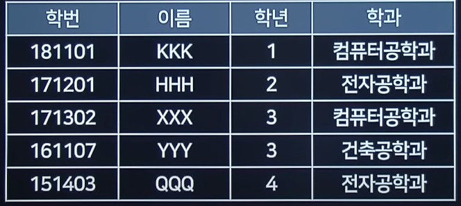

# 2021 실기 2차

## 1. 네트워크의 구성 및 유지를 위해 기지국이나 액세스 포인트와 같은 기반 네트워크 장치를 필요로 하지 않고, 멀티 홉 라우팅 기능에 의해 무선 인터페이스가 가지는 통신 거리상의 제약을 극복하며, 노드들의 이동이 자유롭기 때문에 네트워크 토폴로지가 동적으로 변화되는 특징이 있다. 응용 분야로는 긴급 구조, 긴급 회의, 전쟁터에서의 군사 네트워크 등이 있다.

정답 : AD-hoc Network(애드 혹)

<hr>

## 2. 다음 ①, ②에 설명하는 알맞은 답안을 쓰시오.

```
- ( ① ) : 사용자가 제품/서비스와 상호작용할 수 있도록 만들어진 매개체
- ( ② ) : 사용자 경험의 약자로, 사용자가 어떠한 서비스/제품을 직간접적으로 이용하면서 느끼는 종합적인 만족
```

정답 :

① : UI

② : UX

<hr>

## 3. 다음 파이썬 프로그램의 실행결과를 쓰시오.

```python

a = 100
result = 0
for i in range(1,3):
    result = a >> i
    result = result + 1
print(result)

```

정답 : 26

<hr>

## 4. 디자인 패턴 중 클래스나 서로 상호 작용하는 방법이나 책임 분배 방법을 정의하는 패턴으로, Chain of Responsibility, Command, Iterator, Observer 패턴 등이 있다.

정답 : 행위패턴

<hr>

## 5. 트랜잭션의 특성 중 원자성에 대해 설명하시오.

정답 : 연산의 결과는 모두 반ㄴ영되거나 모두 반영되지 않아야 한다.

<hr>

## 6. 부분 함수적 종속성을 제거하여 완전 함수 종속을 만족하는 정규형이 무엇인지 쓰시오.

정답 : 제2정규형

<hr>

## 7. 다음에 설명하는 대칭키 암호를 쓰시오

```
- NIST가 주최한 공모전에서 채택된 Rijndeal 알고리즘을 가리킨다.
- DES를 대신하여 새로운 표준이 되었다.
- 블록 크기는 128bit이고, 키 길이는 128/192/256bit 이다.
- SPN 구조이다.
```

정답 AES

<hr>

## 8. 다음 C 프로그램의 실행결과를 쓰시오.

```c
int main() {
    int array[3];
    int s = 0;
    *(array+0) = 1;
    array[1] = *(array+0) + 2;
    array[2] = *array + 3;
    for(int i = 0; i < 3; i++) {
        s = s + array[i];
    }
    printf("%d", s)
}

```

정답 : 8

<hr>

## 9. 다음 JAVA 프로그램의 실행결과를 쓰시오.

```java

public class Class01 {
    public static void main(String[] args) {
        Class01 c1 = new Class01();
        Class02 c2 = new Class02();
        System.out.println(c1.sum(3,2) + c2.sum(3,2));
    }
    int sum(int x, int y) {
        return x + y;
    }
}

class Class02 extends Class01 {
    int sum(int x, int y) {
        return x-y+super.sum(x,y)
    }
}

```

정답 : 11

<hr>

## 10. 다음의 <학생> 테이블에서 이름이 '이'씨로 시작하는 사람을 내림차순 정렬로 출력하는 SQL문을 완성하시오.



정답 :

SELECT 이름 FROM 학생
WHERE 이름 LIKE "이\*"
ORDER BY 이름 DESC

<hr>

## 11. 하나의 트랜잭션이 데이터를 액세스하는 동안 다른 트랜잭션이 그 데이터 항목을 액세스할 수 없도록 하는 병행 제어 기법이 무엇인지 쓰시오.

정답 : 로킹(Locking)

<hr>

## 12. 다음 ①~③에 설명하는 알맞은 답안을 쓰시오

<pre>
- ( ① ) : 모듈이 다수의 관련 기능을 가질 때 모듈 내부의 기능 요소들이 그 기능을 순차적으로 수행할 경우
- ( ② ) : 동일한 입력과 출력을 사용하는 고작업들이 모인 경우
- ( ③ ) : 모듈 내부의 모든 기능 요소들이 한 문제와 연관되어 수행되는 경우
</pre>

정답 :

① : 절차적

② : 교환적

③ : 기능적

<hr>

## 13. 학생 테이블에서 점수가 90점 이상인 학생의 과목평가를 "A"로 수정하는 SQL 문을 완성하시오

```sql

( ① ) 학생
( ② )
    과목평가 = 'A'
WHERE 점수 >= 90

```

정답 :

① : UPDATE

② : SET

<hr>

## 14. 다음 패킷 교환방식에 대한 설명으로 ①, ②에 알맞은 용어를 쓰시오.

```

( ① ) : 패킷을 전송하기 전에 논리적인 연결을 먼저 수행하여 패킷을 주고받는다.
( ② ) : 각 전송 패킷을 미리 정해진 경로 없이 독립적으로 처리하여 교환하는 방식이다.

```

정답 :

① : 가상회선 방식

② : 데이터그램 방식

<hr>

## 15. 학생정보와 학과정보를 조인하여 결과값을 출력하는 SELECT문을 완성하시오

```sql
SELECT * FROM 학생정보 T1 JOIN 학과정보 T2
( ② ) T1.학과 = T2.( ② )
```

정답 :

① : ON

② : 학과

<hr>

## 16. <보기>에 해당하는 용어를 쓰시오

<pre>
<div align="center"><보기></div>
- 특정 시스템 컴포넌트의 개발이 완료되지 않은 상황에서도 필요한 시험을 진행하기 위해 생성된 더미 컴포넌트이다.
- 하향식 통합 테스트에서 사용하는 임시 모듈이다.
</pre>

정답 : 스텁(STUP)

<hr>

## 17. 클래스를 생성하지 않고 사용할 수 있는 메소드를 선언할 때 사용하는 명령어이다. 아래 JAVA 소스코드에 들어갈 명령어가 무엇인지 쓰시오.

```java

public class ClassA {
    public static void main(String args[]) {
        System.out.println(check(1));
    }
    (   ) String check(int num) {
         return num;
    }
}

```

정답 : static

<hr>

## 18. 화이트박스 테스트에서 수행하는 구조적 커버리지의 설명으로 알맞은 것을 쓰시오.

<pre>
- ( ① ) : 시험 대상의 전체 구문 중에 테스트에 의해 실행된 구문을 측정한다.
- ( ② ) : 시험 대상의 전체 분기 중 테스트에 의해 실행된 것을 측정한다.
- ( ③ ) : 모든 조건식의 true, false 중 테스트에 의해 실행된 것을 측정한다.
</pre>

정답 :

① : 구문/문장

② : 결정/분기

③ : 조건

<hr>

## 19. 럼바우 객체지향 분석 기법의 설명이다. 해당 설명의 유형을 쓰시오.

<pre>
- ( ① ) : 자료 흐름도(DFD), 프로세스들의 자료 흐름을 중심으로 처리 과정 표현.
- ( ② ) : 상태 다이어그램, 시간의 흐름에 따라 객체들 사이의 제어 흐름, 동작 순서 등의 동적인 행위를 표현
- ( ③ ) : 객체 다이어그램, 정보 모델링이라고도 하며 시스템에서 요구하는 객체를 찾고 객체들 간의 관계를 정의, 가장 중요하며 선행되어야 함.
</pre>

정답 :

① : 기능 모델링(Functional Modeling)

② : 동적 모델링(Dynamic Modeling)

③ : 객체 모델링(Object Modeling)

<hr>

## 20. 다음 C 프로그램의 실행결과를 쓰시오.

```c

int fp(int base, int exp) {
    int result  = 1;
    for(int i = 0; i < exp; i++) {
        result = result * base;
    }
    return result;
}

int main() {
    int result;
    result = fp(2, 10);
    printf("%d", result);
    return 0
}

```

정답 : 1024
