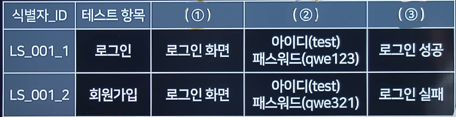
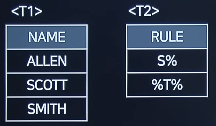

# 2021 실기 3차

## 1. AAA, Triple-A라고 읽는 이 용어는 보안의 세 가지를 합쳐 축약한 용어이다. 다음 ①~③에 해당하는 용어를 <보기>에서 찾아 쓰시오.

<pre>
    <div align="center"><보기></div>
    Authentication, Application, Accounting, Ascii, Avalanche, Authorization
</pre>

```
- ( ① ) : 보안 기능에서, 사람이나 프로세스의 신분을 확인하는 것
- ( ② ) : 검증된 사용자에게 어떤 수준의 권한과 서비스를 허용하는 것
- ( ③ ) : 사용자의 자원에 대한 사용 정보를 모아서 과금, 감사, 용량증설, 리포팅 등을 실시하는 것

```

정답 :

① : Authentication

② : Authorization

③ : Accounting

<hr>

## 2. 데이터 제어어(DCL)의 하나인 GRANT의 기능에 대해 간략히 서술하시오.

정답 : 사용자에게 접속권한, 생성권한 등을 부여하는 명령어(권한설정)

<hr>

## 3. 다음에 설명하는 보안위협에서 괄호에 들어갈 알맞은 답을 쓰시오.

<pre>
(   ) 스푸핑은 MAC 주소를 속여 랜에서의 통신 흐름을 왜곡시키는 공격이다. 공격 대상 컴퓨터와 서버 사이의 트래픽을 공격자의 컴퓨터로 우회시켜 패스워드 정보 등 원하는 정보를 획득할 수 있다.
</pre>

정답 : ARP

<hr>

## 4. 결합도의 종류 중, 어떤 모듈이 다른 모듈을 호출할 때, 단순히 값만 전달되는 형태가 아닌 제어 신호를 전달할때 생기는 결합도를 영문으로 쓰시오.

정답 : control coupling

<hr>

## 5. 디자인 패턴에 관한 설명에서 알맞은 답을 <보기>에서 고르시오.

<pre>
<div align="center"><보기></div>
Abstract Factory, FactoryMethod, Prototype, Builder, Observer, Facade, Composite, Template Method, Singleton
</pre>

```
- 객체 생성 처리를 서브 클래스로 분리해 처리하도록 캡슐화하는 패턴
- 객체의 생성 코드를 별도의 클래스/메서드로 분리함으로써 객체 생성의 변화에 대비하는 데 유용하다.
- 상위클래스에서 객체를 생성하는 인터페이스를 정의하고, 하위클래스에서 인스턴스를 생성하도록 하는 방식
- Virtual-Constructor 패턴이라고도 함
```

정답 : FactoryMethod

<hr>

## 6. 다음은 파일 구조에 대한 설명이다. 빈 칸에 알맞은 답을 작성하시오.

<pre>
- 파일의 구조는 파일을 구성하는 레코드들이 보조기억장치에 편성되는 방식을 의미하는 것으로, 편성 방법에 따라 순차, (   ), 랜덤, 해싱 등이 있다.
- (   )은 순차 처리와 랜덤 처리가 모두 가능하도록 레코드들을 키 값 순으로 정렬하여 기록하여 데이터에 접근한다. 자기 디스크에서 주로 사용된다.
</pre>

정답 : 색인

<hr>

## 7. 다음은 소프트웨어 테스트에 관한 설명이다. ①, ②에 들어갈 알맞은 답을 쓰시오.

```
- ( ① ) : 는 소프트웨어의 하위 모듈에서 상위 모듈 방향으로 통합하면서 테스트 하는 기법이다.
- 상위 모듈의 역할을 하는 ( ② )가 필요하다.
- ( ② )는 하위 모듈을 순서에 맞게 호출하고, 호출할 때 필요한 매개 변수를 제공하며, 반환 값을 전달하는 역할을 한다.
```

정답 :

① : 상향식 테스트

② : 테스트 드라이버

<hr>

## 8. Windows나 Mac OS 등에서 사용하는 인터페이스로, 사용자가 명령을 직접 입력하지 않고, 아이콘 등을 클릭하여 작업을 수행하는 사용자 인터페이스를 영문약어로 작성하시오.

정답 : GUI

<hr>

## 9. 다음 UML(Unified Modeling Language)에 관한 설명에서 괄호에 들어갈 알맞은 답을 쓰시오.

```
- (   )는 자기만의 속성(Attribute)과 일정한 행동(Behavior)으로 구성되어 있다.
- 서로 연관이나 상속, 의존 관계 등으로 서로 간의 상호 작용을 표현한다.
- 대표적인 구조 다이어그램이다.
```

정답 : 클래스 다이어그램

<hr>

## 10. 블록 암호의 일종으로, IBM에서 개발하고, 미국 NBS(현재 NIST)에서 국가 표준으로 정한 암호화 알고리즘이나 취약점이 발견되어 현재는 잘 사용되지 않는다. 블록 크기는 64비트, 키 길이는 56회이며 16라운드를 수행한다. 페이스텔(Feistel) 구조를 사용하는 암호화 알고리즘은 무엇인지 쓰시오.

정답 : DES

<hr>

## 11. 다음은 테스트케이스으 구성요소에 대한 설명이다. 괄호() 안에 들어갈 알맞는 답을 쓰시오.



정답 :

① : 테스트 조건

② : 테스트 데이터

③ : 예상 결과

<hr>

## 12. UML 관계에 대한 설명이다. 다음 ①, ②에 들어갈 알맞은 용어를 쓰시오.

```
- ( ① ) : 클래스들 사이의 전체 또는 부분 같은 관계
- ( ② ) : 한 클래스가 다른 클래스를 포함하는 상위 개념일 때의 IS-A 관계
```

정답 :

① : Aggregation

② : Generalization

<hr>

## 13. OSI 7Layer에 대한 설명에서 ①~③에 들어갈 알맞은 계층을 쓰시오.

<pre>
( ① ) : 물리계층을 통해 송수신 되는 정보의 오류와 흐름을 관리하여 안전한 정보의 전달을 수행할 수 있도록 도와준다.
( ② ) : 데이터를 목적지까지 가장 안전하고 빠르게 전달 가능
( ③ ) : 데이터 표현이 상이한 응용 프로세스의 독립성을 제공하고 암호화한다.
</pre>

정답 :

① : 데이터링크 계층

② : 네트워크

③ : 표현 계층

<hr>

## 14. 테스트 기법 중, 입력 데이터 간의 관계와 출력에 영향을 미치는 상황을 체계적으로 분석하여 효용성 높은 검사 사례를 선정하여 검사하는 기법을 아래에서 찾아 쓰시오.

```
Equivalence Partitioning
Boundary Value Analysis
Cause-effect Graphing
Fault based
Base Path Test
Loop Test
Comparison Testing
```

정답 : Cause-effect Graphing

<hr>

## 15. T1 테이블과 T2 테이블을 참고하여 SQL 실행결과를 쓰시오.



```sql
SELECT COUNT(*) AS CNT FROM A CROSS JOIN B
WHERE A.NAME LIKE B.NAME
```

정답 : 4

<hr>

## 16. 다음 Python 프로그램을 분석하여 실행 결과를 쓰시오.

```python
x, y = 100, 200
print( x == y)
```

정답 : False

<hr>

## 17. 다음 C언어 프로그램을 분석하여 실행 결과를 쓰시오.

```c

struct jsu {
    char name[12];
    int os, db, hab, hhab;
};

int main() {
    struct jsu st[3] = { {"데이터1", 95, 88}, {"데이터2", 84, 91}, {"데이터3", 86, 75} };
    struct jsu* p;

    p = &st[0];
    (p + 1)->hab = (p + 1) -> os + (p + 2) -> db;
    (p + 1)->hhab = (p + 1) -> hab + p-> os + p -> db;
    printf("%d\n", (p + 1) -> hab + (p + 1) -> hhab);
}

```

정답 : 501

<hr>

## 18. 다음 C언어 프로그램을 분석하여 실행 결과를 쓰시오.

```c

void main() {
    int *arr[3];
    int a = 12, b = 24, c = 36;
    arr[0] = &a;
    arr[1] = &b;
    arr[2] = &c;
    printf("%d\n", *arr[1] + **arr + 1);
}

```

정답 : 37

<hr>

## 19. 다음 JAVA 언어 프로그램을 분석하여 실행 결과를 쓰시오.

```java

int a = 3, b = 4, c = 3, d = 5;
if((a == 2 | a == c) & !(c > d) & (1 == b ^ c != d)) {
    a = b + c
    if(7 == b ^ c != a ) {
        System.out.println(a);
    } else {
        System.out.println(b);
    }
} else {
    a = c + d;
    if(7 == c ^ d != a) {
        System.out.println(a);
    } else {
        System.out.println(d);
    }
}


```

정답 : 7

<hr>

## 20. 다음 JAVA 언어 프로그램을 분석하여 실행 결과를 쓰시오.

```java

class Connection {
    private static Connection _in = null;
    private int count = 0;
    static public Connection get() {
        if(_in == null) {
            _in = new Connection();
            return _inst;
        }
        return _inst;
    }
    public void count() { count ++;}
    public int get() {return count;}
}

public class testcon {
    public static void main(String[] args) {
        Connection conn1 = Connection.get();
        conn1.count();
        Connection conn2 = Connection.get();
        conn2.count();
        Connection conn3 = Connection.get();
        conn3.count();

        System.out.print(conn1.getCount());
    }
}

```

정답 : 3
