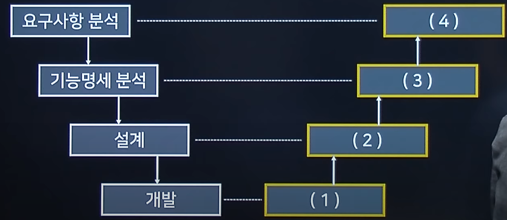
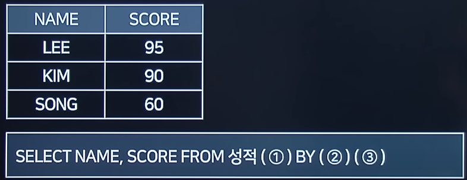

# 2022 실기 1차

## 1. 다음 설명에 맞는 RAID 단계를 쓰시오.

<pre>
- 두 개 이상의 하드디스크를 병렬로 연결해, 하나의 하드디스크처럼 이용하는 기술이다.
- 스트라이프(Stripe) 방식으로 구현한다.
- 데이터가 분산되어 저장되기 때문에 하나의 하드디스크에 문제가 생기면 다른 디스크까지 사용이 불가능해진다.
</pre>

정답 : RAID 1

<hr>

## 2. 다음은 로그 기반 회복 기법에서 사용되는 명령어이다.<br>해당하는 항목을 보기에서 찾아 적으시오.

<pre>
1. 트랜잭션 로그를 이용하여 오류가 발생한 트랜잭션을 재실행하여 복구를 수행한다.
2. 트랜잭션 로그를 이용하여 오류와 관련된 내용을 취소하여 복구를 수행한다.
</pre>

정답 :

1. REDO
2. UNDO

<hr>

## 3. 데이터베이스의 이상현상 중, 삭제 이상에 대해 간략히 서술하시오.

정답 : 한 튜플을 삭제할 때 연쇄 삭제 현상으로 인해 정보 손실

<hr>

## 4. 아래 임시 키 무결성 프로토콜의 영문 약어를 쓰시오

<pre>
임시 키 무결성 프로토콜은 IEEE 802.11의 무선 네트워킹 표준으로 사용되는 보안 프로토콜이다.
임시 키 무결성 프로토콜은 IEEE 802.11i의 작업 그룹과 와이파이 얼라이언스에서 WEP를 하드웨어의 교체 없이 대체하기 위해 고안되었다.
</pre>

정답 : TKIP(Temporal Key Integrity Protocol)

<hr>

## 5. 아래 설명하는 내용을 영문 약자로 쓰시오.

<pre>
특별한 하드웨어 없이 인간의 자연스러운 움직임을 인식하여 정보를 제공한다.
</pre>

정답 : NUI

<hr>

## 6. 다음 소스코드 분석 도구에 대한 설명으로 알맞은 답을 보기에서 찾아 작성하시오.

<pre>
1. 소스코드의 실행 없이, 코드의 의미를 분석하여 결함을 찾아내는 코드 분석 기법
2. 소스코드를 실행하여 프로그램의 동작이나 결과를 확인하고, 메모리 누수, 스레드 결함 등을 분석하는 기법
</pre>

정답 :

1. 정적 테스트(static)
2. 동적 테스트(dynamic)

<hr>

## 7. 아래에 설명하는 테스트 도구를 쓰시오.

```
- 자바 프로그래밍 언어용 유닛 테스트 프레임워크
- 테스트 결과는 Test클래스로 개발자에게 테스트 방법 및 클래스의 History를 공유 가능
- 어노테이션으로 간결하게 지원

```

정답 : JUnit

<hr>

## 8. 다음 보기 중에서 블랙박스 테스트 기법을 3가지 골라 작성하시오.

```
1. Equivalence Partitioning
2. Boundary Value Analysis
3. Base Path Test
4. Loop Test
5. Decision Coverage
6. Cause-effect Graph
```

정답 :

Equivalence Partitioning, Boundary Value Anlysis, Cause-effect Graph

<hr>

## 9. 다음 설명에 대한 답을 영어 약자로 쓰시오.

<pre>
기업이 주요 정보자산을 보호하기 위해 수립/관리/운영하는 정보 보호 관리체계가 인증 기준에 적합한지를 심사하여 인증을 부여하는 제도
</pre>

정답 : ISMS(Information Security Management System - 정보 보안 관리 체계)

<hr>

## 10. 다음은 데이터베이스 키에 대한 설명이다.<br>빈 칸에 들어갈 내용을 알맞게 쓰시오.

```
1. 슈퍼키는 ( ① )의 속성을 갖는다.
2. 후보키는( ① )과 ( ② )의 속성을 갖는다.
```

정답 :

① : 단일성

② : 최소성

<hr>

## 11. 다음에서 설명하는 공격 유형을 쓰시오.

<pre>
이 공격은 APT 공격에서 주로 쓰이는 공격이며, 타겟이 자주 들어가는 홈페이지를 파악했다가, 그 홈페이지의 취약점을 통해 악성코드를 심어 사용자가 모르게 해당 악성코드를 다운로드 받게 하고, 다운로드된 악성코드를 통해 공격을 하는 방식을 취한다.
</pre>

정답 : Watering Hole

<hr>

## 12. 다음 V모델에서의 테스트 단계에 대한 설명으로 괄호 안에 들어갈 내용을 쓰시오.



정답 :

1. 단위 테스트
2. 통합 테스트
3. 시스템 테스트
4. 인수 테스트

<hr>

## 13. 다음 SQL 결과에 알맞는 쿼리를 작성하시오.



정답 :

1. ORDER
2. SCORE
3. DESC

<hr>

## 14. 다음 설명과 관련된 파이썬 함수를 골라 작성하시오.

<pre>
1. 요소를 확장해주는 역할을 하며, 모든 항목을 하나의 요소로 추가
2. 리스트 내부 요소를 꺼내주는 함수, 해당 함수를 호출하면 리스트에서 해당 값을 삭제하면서 리턴시켜준다.
3. 리스트 내부의 요소의 순서를 뒤집어주는 역할을 한다.
</pre>

정답 :

1. extend
2. pop
3. reverse

<hr>

## 15. 다음 파이썬 코드에서 출력되는 결과를 작성하시오.

```python

def func1(num1, num2=2) :
    print('a=', num1, 'b=', num2)
func1(20)

```

정답 : a=20b=2

<hr>

## 16. 다음 JAVA 코드 중 밑줄에 들어갈 알맞은 코드를 작성하시오.

```java

class Car implements Runnalbe {
    int a;
    public void fun() {
        System.out.println("func call");
    }
}
public class Main {
    public static void main(String[] args) {
        Thread t1 = new Thread( new ____());
        t1.start();
    }
}

```

정답 : Car

<hr>

## 17. 다음 JAVA 프로그램의 결과를 쓰시오.

```java

class A {
    int a;
    int b;
}

public class Main {
    static void func1(A a){
        a.a *=10;
    }
    static void func2(A a){
        a.a += a.b
    }
}

A a = new A();
a.a = 100
func1(a);
a.b = a.a;
func2(a);
System.out.println(a.a)

```

정답 : 2000

<hr>

## 18. 다음 C언어 프로그램의 출력결과를 쓰시오.<br>(단, 입력값은 5가 들어왔다고 가정한다.)

```c

#include<stdio.h>
int func(int i) {
    if(i <= 1) return 1;
    return i * func(i - 1);
}
int main() {
    int in;
    scanf("%d", &in);
    printf("%d", func(in))
}

```

정답 : 120

<hr>

## 19. 다음 C언어 프로그램의 괄호 안에 들어갈 알맞은 답을 작성하시오.

```c

#include<stdio.h>
int main(){
    int num = 1234;
    int div = 10;
    int res = 0;
    while(num ① 0) {
        res = res * div;
        res = res + num ② div;
        num = num ③ div;
    }
    printf("%d",res);
}

```

정답 :

1. \>
2. %
3. /

<hr>

## 20. 다음 C언어 프로그램의 결과를 쓰시오.

```c

int isPrime(int number){
    int i;
    for(i=2; i<number; i++){
        if(number % i==0) return 0;
    }
    return1
}

int main(void){
    int number = 13195, max_div = 0, i;
    for(i=2; i<number; i++)
        if(isPrime(i) == 1 && number % i == 0)
            max_div = i;
    printf("%d", max_div);
    return 0
}

```

정답 : 29
