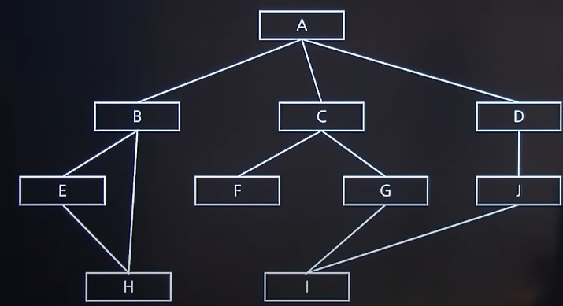
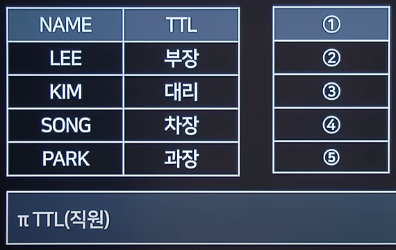
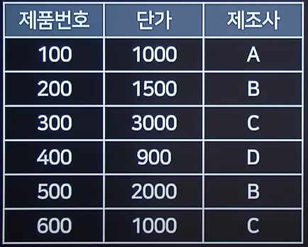
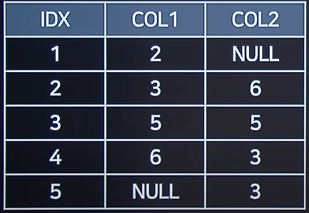

# 2022 실기 2차

## 1. 다음 괄호에 들어갈 용어를 쓰시오.

<pre>
- 관계 데이터 모델의 제안자인 코드(E.F. Codd)가 수학의 Predicate Calculus(술어 해석)에 기반을 두고 관계 데이터베이스를 위해 제안하였다.
- (   )은 관계 데이터의 연산을 표현하는 방법으로, 원하는 정보를 정의할 때 계산 수식을 사용.
- (   )은 원하는 정보가 무엇이라는 것만 정의하는 비절차적 특성
</pre>

정답 : 관계해석

<hr>

## 2. 다음 ①~②에 해당하는 암호화 알고리즘 용어를 쓰시오.

<pre>
( ① )은 1990년 스위스에서 만들어진 PES를 개량하여 만들어진 블록 암호 알고리즘으로 키 길이가 128bit, 블록길이가 64bit이다.
Feistel 방식과 SPN의 중간형태 구조이다.
( ② )은 미 국가안보국(NSA)에서 개발한 알고리즘으로, 64비트의 입출력, 80비트의 키, 32라운드를 가진다. 주로 전화기와 같은 음성을 암호화하는데 사용된다고 한다.
</pre>

정답 :

① : IDEA

② : Skipjack

<hr>

## 3. 다음에 설명하는 용어를 영문약어로 적으시오.

<pre>
인터넷 등 통신 사업자의 공중 네트워크에 암호화 기술을 이용하여 사용자가 마치 자신의 전용 회선을 사용하는 것처럼 해주는 보안솔루션
</pre>

정답 : VPN

<hr>

## 4. 아래 설명에서 ①~④에 해당하는 용어를 적으시오.

<pre>
네트워크 집합을 몇 개의 그룹으로 나누었을 때 동일 그룹 내에서 라우팅 정보를 교환할 때 사용하는 라우팅 프로토콜을 ( ① )라고 하고, 다른 그룹과 라우팅 정보를 교환하는 프로토콜을 ( ② )라고 한다.
( ① )의 대표적인 프로토콜은 RIP와 ( ③ )가 있고, ( ② )의 대표적인 프로토콜은 ( ④ )이다.
</pre>

정답 :

① : IGP

② : EGP

③ : OSPF

④ : BGP

<hr>

## 5. 아래 ①~②에서 설명하는 테스트 종류를 쓰시오.

<pre>
①은 개발자의 통제 하에 사용자가 개발 환경에서 수행하는 테스트이다.
내부에서 진행하는 자체 검사로 실제 사용 환경에서 동작시키며 관련자만 참여한다.
②는 개발된 소프트웨어를 사용자가 실제 운영환경에서 수행하는 테스트이다.
① 수행 이후 정식으로 출시하기 전 사용자에게 테스트를 하도록 한다.
</pre>

정답 :

① : 알파 테스트

② : 베타 테스트

<hr>

## 6. 변경 또는 수정된 코드에 대하여 새로운 결함 발견 여부를 평가하는 테스트는 무엇인지 보기에서 찾아 쓰시오.

정답 : Regression

<hr>

## 7. 다음 주어진 구조에서 C의 Fan-In 과 Fan-Out을 구하시오.



정답 :

Fan-In : 1

Fan-Out : 2

<hr>

## 8. 아래 ①~③에서 해당하는 용어를 쓰시오.

<pre>
( ① )는 W3 상에서 정보를 주고받을 수 있는 프로토콜이다.
GET< POST 방식을 이용하여 문서를 주고 받는데, 이 문서 내에서 다른 문서를 링크정보가 들어가는데, 이런 링크 정보를 만들 수 있는게 ( ② )이다.
이런 ( ② )를 만들 수 있는 마크업언어가 ( ③ )이다.
</pre>

정답 :

① : HTTP

② : Hyper text

③ : HTML

<hr>

## 9. 객체지향 설계 원칙 중 아래에 설명하는 용어를 보기에서 찾아 쓰시오.

<pre>
자신이 사용하지 않는 인터페이스는 구현하지 말아야 하고,
자신이 사용하지 않는 인터페이스 때문에 영향을 받아서는 안된다.
그러므로 인터페이스를 작게 나누어 만들어야 한다.
</pre>

정답 : 인터페이스 분리 원칙(ISP, Interface Segregation Principle)

<hr>

## 10. IP 주소가 192.168.100.132이고, 서브넷 마스크가 255.255.255.192인 경우 ①~②에 해당하는 값을 쓰시오

```
네트워크 주소 192.168.100.①
사용 가능한 주소 개수 ②
```

정답 :

① : 128

② : 62

서브넷 마스크 255.255.255.192의 192는

11000000의 앞의 11을 주소로 사용하겠다는 의미

| 128 | 64  | 32  | 16  |  8  |  4  |  2  |  1  |
| :-: | :-: | :-: | :-: | :-: | :-: | :-: | :-: |
|  1  |  1  |  0  |  0  |  0  |  0  |  0  |  0  |

네트워크 주소에 적용 가능한 앞자리 : 00, 01, 10, 11

00 000000~111111(63)

01(64) 000000~111111(63)

10(128) 000000~111111(63)

11 000000

11000000(192) 전 최대치는 10111111(191)

맨 앞의 숫자는 네트워크 주소를 의미하기 때문에 128은 네트워크 주소 ①이 된다.

사용 가능한 주소 개수는 네트워크 주소(맨 앞)과 브로드캐스트 주소(맨 뒤) 2개는 제외한다.

10으로 시작하면서 가장 큰 수는 10(네트워크 주소)111111

총 주소 개수 = 2\*\*6 = 64

맨 앞, 맨 뒤 제외(-2)

64 - 2 = 62

사용 가능한 주소 개수 = 62

<hr>

## 11. 다음 직원 릴레이션에서, 다음 관계대수식을 실행한 결과를 ①~⑤에 쓰시오



정답 :

1. TTL
2. 부장
3. 대리
4. 차장
5. 과장

<hr>

## 12. 상품 테이블에서 B제조사 전체 제품의 단가보다 더 큰 단가를 가진 제품을 모두 출력하는 SQL문을 완성하시오



```sql
SELECT * FROM 상품
WHERE 단가 > ( ① )
(
    SELECT 단가 FROM 상품
    WHERE 제조사 = 'B'
)
```

정답 :

① : ALL

<hr>

## 13. 다음 릴레이션의 데이터는 다음과 같이 저장되어 있다. SQL을 수행했을 때 결과를 쓰시오.



```sql

SELECT COUNT(COL2) FROM TABLE
WHERE COL1 IN(2,3) OR COL2 IN(3,5)

```

정답 : 4

<hr>

## 14. 다음은 함수적 종속에 해당하는 설명이다. ①~③에 해당하는 용어를 보기에서 찾아 쓰시오.

<pre>
- 함수적 종속관계에서 종속자가 기본키에만 종속되며, 기본키가 여러 속성으로 구성되어 있을경우 기본키를 구성하는 모든 속성이 포함된 기본키의 부분집합에 종속된 경우 이를 ( ① )이라 한다.
- 기본키가 여러 속성으로 구성되어 있을 경우 기본키를 구성하는 속성중 일부만 종송되는 경우 이를 ( ② )라고 한다.
- X->Y, Y->Z 란 종속 관계가 있을 경우, X->Z가 성립되는 경우를 ( ③ )라 한다.
</pre>

정답 :

① : 완전함수 종속(Full)

② : 부분함수 종속(Partial)

③ : 이행적 함수 종속(Transitive)

<hr>

## 15. 다음 C언어 프로그램의 출력결과를 쓰시오.

```c
#include<stdio.h>
struct st {
    int x, y;
}
int main(){
    struct st dt[2];
    for(int i = 0; i < 2; i++){
        dt[i].x = i;
        dt[i].y = i+1;
    }
    printf("%d", dt[0].x + dt[1].y);
}

```

정답 : 2

<hr>

## 16. 다음 C언어 프로그램의 출력결과를 쓰시오

```c
#include<stdio.h>
int main(){
    char *p1 = "2022";
    char *p2 = "202210"l
    int i = func(p1);
    int j = func(p2);
    printf("%d", i+j);
    return 0;
}

int func(char *p){
    int cnt = 0;
    while(*p != "\0"){
        cnt++;
        p++;
    }
    return cnt;
}

```

정답 : 10

<hr>

## 17. 다음 C언어 프로그램의 출력결과를 쓰시오

```c

#include<stdio.h>
int main(){
    int a[4] = {0,2,4,8};
    int b[3];
    int *p;
    int sum = 0;
    for(int i = 1;i < 4; i++){
        p = a + i;
        b[i-1] = *p - a[i-1];
        sum += b[i-1] + a[i];
    }
    printf("%d", sum);
}

```

정답 : 22

<hr>

## 18. 다음 JAVA 프로그램의 출력결과를 쓰시오.

```java

public static void main(String[] args) {
    int i = 3;
    int sum = 0;
    switch(i) {
        case 0: sum++;
        case 1: sum+=3;
        case 2: sum-=10;
        case 3: sum=0;
        case 4: sum+=3;
        case 5: sum-=10;
        default: sum--;
    }
    System.out.println(sum);
}

```

정답 : -8

<hr>

## 19. 다음 JAVA 프로그램의 출력결과를 쓰시오.

```java

class Cal {
    int a;
    Cal(int a) {
        this.a = a;
    }
    int func() {
        int b = 1;
        for(int i = 1; i < a; i++)
            b = a * i + b;
        return a + b;
    }
}

public class Main {
    public static void main(String[] args) {
        Cal obj = new Cal(3);
        obj.a = 5;
        int b = obj.func();
    System.out.println(obj.a + b);
    }
}

```

정답 : 61

<hr>

## 20. 다음 파이썬 코드에서 출력되는 결과를 작성하시오

```python

str1 = "REMEMBER NOVEMBER"
str2 = str1[:3] + str1[12:16]
str3 = "R AND %s" % "STR"
print(str2 + str3)

```

정답 : REMEMBER AND STR
