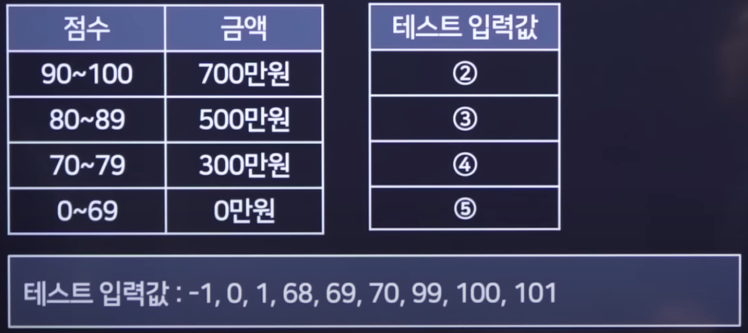
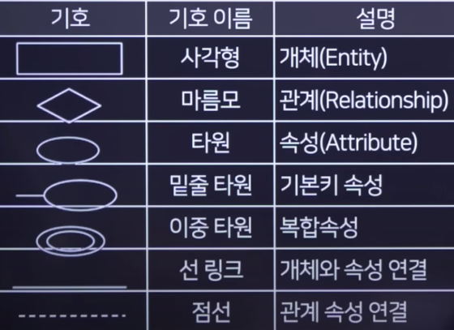
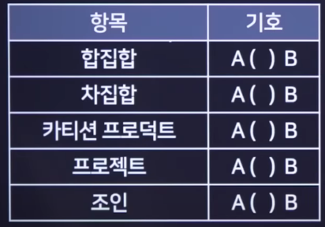
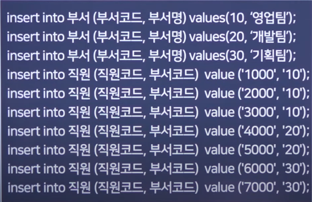
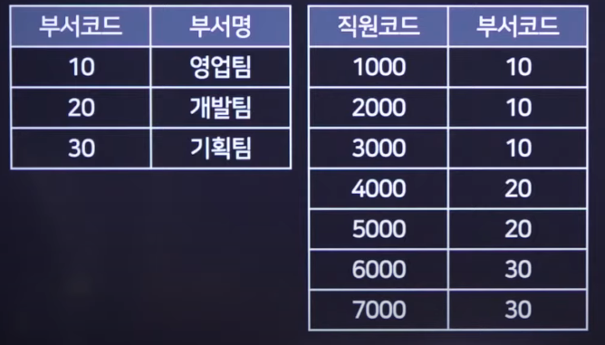

# 2022 실기 3차

## 1. 다음 중 형상관리 도구에 해당하는 것을 모두 고르시오.

```
Ant
CVS
OLAP
MAVEN
SVN
Jenkins
OLTP
Git
Gradel
```

정답: CVS, SVN, Git

<hr>

## 2. 다음은 디자인 패턴에 대한 설명이다. 괄호안에 알맞는 답을 작성하시오.

<pre>
- ( ① )은 구현부에서 추상층을 분리하여 각자 독립적으로 변형이 가능하고 확장이 가능하도록 합니다. 즉 기능과 구현에 대해서 두 개를 별도의 클래스로 구현을 합니다.
- ( ② ) 한 객체의 상태가 바뀌면 그 객체에 의존하는 다른 객체들한테 연락이 가고, 자동으로 내용이 갱신되는 방식의 패턴이다.
</pre>

정답 :

① : Bridge

② : Observer

<hr>

## 3. 다음은 UML에 관한 설명이다.

<pre>

UML은 컴퓨터 애플리케이션을 모델링 할 수 있는 통합 언어이다.
구성요소로는 사물, ( ① ), 다이어그램으로 이루어져 있고,
구조 다이어그램중 ( ② ) 다이어그램은 객체들의 타입을 정의하고, 객체들 간의 관계를 도식화하여 시스템의 특정 모듈이나 일부 및 전체를 구조화한다.
UML 모델링에서는 ( ③ )는 클래스와 같은 기타 모델 요소 또는 컴포넌트가 구현해야 하는 오퍼레이션 세트를 정의하는 모델 요소이다.

</pre>

정답 :

①: 관계

②: 클래스

③: 인터페이스

<hr>

## 4. 아래 점수에 따라 점수를 출력하는 테스트를 진행하려고 한다.<br>다음과 같은 테스트 입력값을 넣을때의 테스트 방식을 쓰시오.



정답 : 경계값 분석

<hr>

## 5. 아래에 설명하는 용어를 작성하시오.

<pre>
- 여러 개의 사이트에서 한번의 로그인으로 여러가지 다른 사이트들을 자동적으로 접속하여 이용하는 방법을 말한다.
- 하나의 시스템에서 인증을 할 경우 타 시스템에서는 인증 정보가 있는지 확인하고 있으면 로그인 처리를 하도록 하고, 없는 경우 다시 통합 인증을 할 수 있도록 만드는 것을 의미한다.
</pre>

정답 : SSO(Same Sign-on)

<hr>

## 6. ERD 기호 문제



<hr>

## 7. 다음은 프로세스 스케줄링에 관련된 내용이다.<br>괄호에 맞는 답을 작성하시오.

<pre>
- ( ① ) : 선점형 스케줄링 기법으로 CPU 점유 시간이 가장 짧은 프로세스에 CPU를 먼저 할당하는 방식
- ( ② ) : 시간단위(Time Quantum/Slice)를 정해서 프로세스를 순서대로 CPU를 할당하는 방식
- ( ③ ) : 비 선점형 스케줄링 기법으로 실행시간이 가장 짧은 프로세스에게 CPU를 할당하는 방식
</pre>

정답 :

① : SRF(Shortest Remaining Time First)

② : RR(Round Robin)

③ : SJF(Shortest Job First)

<hr>

## 8. 192.168.1.0/24 네트워크를 FLSM 방식으로 3개의 서브넷으로 나눴을 때, 두 번째 네트워크의 브로드캐스트 아이피를 쓰시오.

정답 : 192.168.1.127

192.168.1/고정.0/24

사용 가능한 네트워크

00 | 000000~111111(63)

01 | 000000~111111(63)

10 | 000000~111111(63)

11 | 000000~111111(63)

두 번째 네트워크 = 01

01 네트워크의 범위 = 01(64) 000000(0)~01(64) 111111(63)

브로드캐스트IP는 가용범위의 마지막(01111111 - 127)

정답 : 192.168.1.127

<hr>

## 9. 아래 설명에 대한 알맞은 답을 작성하시오

<pre>
- ( ① ) : 기술적인 방법이 아닌 사람들 간의 기본적인 신뢰를 기반으로 사람을 속여 비밀정보를 획득하는 기법
- ( ② ) : 기업이 정보를 수집한 후, 저장만 하고 분석에 활용하고 있지 않은 다량의 데이터
</pre>

정답 :

① : 사회공학

② : 다크 데이터

<hr>

## 10. 아래 설명에 대한 알맞은 답을 작성하시오

<pre>
- 네트워크 하드웨어 및 응용 프로그램에 의해 생성된 보안 경고의 실시간 분석을 제공한다.
- 빅데이터 수준의 데이터를 장시간 심층 분석한 인덱싱 기반이다.
- 주요기능은 데이터 통합, 상관관계, 알림, 대시보드
</pre>

정답 : SIEM(Security Information and Event Management)

<hr>

## 11. 아래 설명에 대한 알맞은 답을 작성하시오

<pre>
- ( ① ): 독립적인 보안 구역을 따로 두어 중요한 정보를 보호하는 하드웨어 기반의 보안 기술
- ( ② ): 사용자가 사이트의 URL 주소를 입력할 때 철자를 잘못 입력하거나 빠뜨리는 실수를 이용하여, 해커가 만들어 놓은 유사한 URL로 접속하도록 유도하는 공격
</pre>

정답 :

① : Trust Zone

② : 타이포스쿼팅(Typosquatting)

<hr>

## 12. 다음 항복에 맞는 관계대수 기호를 작성하시오.



정답 :

1. ∪
2. -
3. X
4. π
5. ▶◀

<hr>

## 13. 아래의 테이블에서, SQL 명령을 수행할 경우 알맞은 값을 작성하시오.





```sql

SELECT DISTINCT COUNT(직원코드) FROM 직원 부서코드='10';

DELETE FROM 부서 WHERE 부서코드='10';
SELECT DISTINCT COUNT(직원코드) FROM 직원;

```

정답 :

1. 3
2. 4

<hr>

## 14. STUDENT 테이블에 컴퓨터학과 학생 50명, 기계과 학생 100명, 건축과 학생 50명의 데이터가 있다.<br>다음 SQL의 실행결과 튜플의 수는 몇인지 작성하시오.

```sql

① SELECT DEPT FROM STUDENT;
② SELECT DISTINCT DEPT FROM STUDENT;
③ SELECT COUNT(DISTINCT DEPT) FROM STUDENT
WHERE DEPT='건축과';

```

정답:

1. 200
2. 3
3. 1

<hr>

## 15. 다음 프로그램의 출력결과를 2차원 배열 형태로 작성하시오.

N\*\*4문제

<hr>

## 16. 다음 C언어 프로그램의 출력결과를 쓰시오.

```c

int main() {
    int result[5];
    int ary[] = {77, 32, 10, 99, 50};
    for(int i = 0;i < 5; i++){
        result[i] = 1;
        for(int j = 0;j < 5;j++)
            if(ary[i] < ary[j]) result[i]++;
    }
    for(int i = 0;i < 5;i++)
        printf("%d", result[i])
}

```

정답 : 24513

<hr>

## 17. 다음 C언어 프로그램의 출력결과를 쓰시오.

```c

int x,y;
int cnt = 0;
for(int i = 6; i <= 30;i++){
    x = 0;
    y = i/2;
    for(int j = 1;j <= y;j++){
        if(i % j == 0)
            x = x + j
    }
    if(x == i){
        cnt++
    }
}
printf("%d",cnt);

```

정답 : 2

<hr>

## 18. 다음 JAVA 프로그램의 출력결과를 쓰시오.

```java

static int[] makeAry(){
    int[] tmp = new int[4];
    for(int i = 0;i < tmp.length; i++){
        tmp[i] = i
    }
    return tmp;
}

public static void main(String[] args){
    int[] inData = makeAry();
    for(int i = 0; i < inData.length; i++)
        System.out.print(inData[i]);
}

```

정답 : 0123

<hr>

## 19. 다음 JAVA 프로그램의 출력결과를 쓰시오.

```java

int max = 0;
for(int i = 1; i < 999; i++){
    if(i % 3 == 0 && i%2 != 0)
        max = i;
}
System.out.print(max);

```

정답 : 993

<hr>

## 20. 다음 파이썬 코드에 대한 출력값을 작성하시오.

```python

tData = [1,2,3,4,5]
tData = list(map(lambda num : num+100, tData))
print(tData)

```

정답 : [101, 102, 103, 104, 105]
