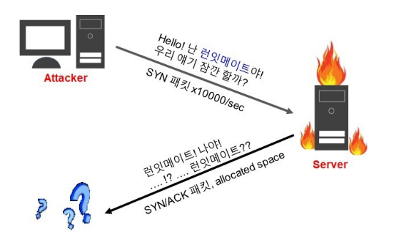

# Remind Keywords

## 반정규화의 유형

|     구분      |       유형       | 설명                      |
| :-----------: | :--------------: | ------------------------- |
|  테이블 분할  |     수평분할     | - 레코드 단위로 분할      |
|               |     수직분할     | - 컬럼 단위로 분할        |
|  테이블 중복  | 통계 테이블 추가 | - DW,OLAP 데이터용        |
|               | 진행 테이블 추가 | - 업무 프로세스 상태      |
| 컬럼기반 분할 |  조회 빈도 기반  | - 고빈도 컬럼 분리        |
|               |  크기 기반 분할  | - 일정 용량 컬럼 분리     |
|   컬럼 중복   |  중복 컬럼 추가  | - 자주 조회되는 컬럼 추가 |
|               |  파생 컬럼 추가  | - 연산 결과 별도 저장     |

## 인터페이스 전송 데이터

- JSON(JavaScript Object Notation)
  - Javascript 객체 문법으로 구조화된 데이터를 표현하기 위한 문자 기반의 표준 포맷
  - JSON 데이터는 이름과 값의 쌍으로 이루어진다.
- XML(eXtensible Markup Language)
  - 웹에서 구조화한 문서를 표현하고 전송하도록 설계한 마크업 언어
- CSV(Comma Separated Values)
  - 몇 가지 필드를 쉼표(,)로 구분한 텍스트 데이터 및 텍스트 파일
- YAML
  - XML, C, 파이썬, 펄, RFC2822에서 정의된 e-mail 양식에서 개념을 얻어 만들어진 '사람이 쉽게 읽을 수 있는' 데이터 직렬화 양식

## 소프트웨어 테스트의 원리

- 테스팅은 결함이 존재함을 밝히는 활동이다.
- 완벽한 테스팅은 불가능하다.
- 테스팅은 개발 초기에 시작해야 한다.
- 결함 집중(파레토 원칙)
  - 많은 성과에서 결과의 약 80%가 20%의 원인에서 발생한다
- 살충제 패러독스
  - 동일한 테스트로 동일한 절차를 반복 수행하면 새로운 결함을 찾을 수 없다.
- 테스팅은 정황(Context)에 의존한다.
- 오류 - 부재의 궤변
  - 결함이 없어도, 요구사항을 충족시켜주지 못한다면 해당 소프트웨어의 품질이 높다고 할 수 없다

## 결합도 유형

|                구분                |                                                  설명                                                  |
| :--------------------------------: | :----------------------------------------------------------------------------------------------------: |
|   자료 결합도 (Data Coupling)   |                                모듈간의 인터페이스로 값이 전달되는 경우                                |
| 스탬프 결합도 (Stamp Coupling)  |                 모듈 간의 인터페이스로 배열이나 오브젝트, 스트럭처 등이 전달되는 경우                  |
| 제어 결합도 (Control Coupling)  |     단순 처리할 대상인 값만 전달되는게 아니라 어떻게 처리를 해야 한다는 제어 요소가 전달되는 경우      |
| 외부 결합도 (External Coupling) |                 어떤 모듈에서 선언한 데이터(변수)를 외부의 다른 모듈에서 참조하는 경우                 |
|  공통 결합도 (Common Coupling)  | 파라미터가 아닌 모듈 밖에서 선언된 전역 변수를 참조하고 전역 변수를 갱신하는 식으로 상호 작용하는 경우 |
| 내용 결합도 (Content Coupling)  |                    다른 모듈 내부에 있는 변수나 기능을 다른 모듈에서 사용하는 경우                     |

## 응집도 유형

|               구분               |                                            설명                                            |
| :------------------------------: | :----------------------------------------------------------------------------------------: |
|  기능적 응집도 (Functional)   |                  모듈 내부의 모든 기능이 단일한 목적을 위해 수행되는 경우                  |
|  순차적 응집도 (Sequential)   |             모듈 내에서 한 활동으로부터 나온 출력값을 다른 활동이 사용할 경우              |
| 통신적 응집도 (Communication) |         동일한 입력과 출력을 사용하여 다른 기능을 수행하는 활동들이 모여 있는 경우         |
|  절차적 응집도 (Procedural)   | 모듈이 다수의 관련 기능을 가질 때 모듈 안의 구성 요소들이 그 기능을 순차적으로 수행할 경우 |
|   시간적 응집도 (Temporal)    |    연관된 기능이라기보다는 특정 시간에 처리되어야 하는 활동들을 한 모듈에서 처리할 경우    |
|    논리적 응집도 (Logicla)    |     유사한 성격을 갖거나 특정 형태로 분류되는 처리 요소들이 한 모듈에서 처리되는 경우      |
| 우연적 응집도 (Coincidental)  |                       모듈 내부의 각 구성 요소들이 연관이 없을 경우                        |

## 서비스 공격 유형의 종류

**※ 보안의 3요소**

- 기밀성 : 타인에게 노출되면 안된다.
- 무결성 : 타인에게 수정되면 안된다.
- 가용성 : 인가된 사용자는 언제든지 사용되어야 한다.

- DoS(Denial Of Service, 서비스 거부) : DDoS와 마찬가지로 가용성을 해침
  - Smurf Attack
    - IP, ICMP를 사용하는 공격으로 나의 IP 주소를 속여 다른 IP로 데이터를 전송하여 다른 IP를 소유한 기기에 장애를 일으킨다.
    - ICMP : 인터넷 제어 메시지 프로토콜(Internet Control Message Protocol, ICMP)은 네트워크 내 장치가 데이터 전송과 관련된 문제를 전달하기 위해 사용하는 프로토콜
    - EX : 공격자의 ip가 1인 경우 발신 header의 발신 ip를 2로 변경해 2번 ip를 가진 서버의 가용성을 해치는 경우
  - SYN flooding
    - 직역 : SYN 패킷이 흘러 넘친다.
    - 과도한 SYN 패킷을 서버에 서버에 부하를 일으킨다.
    - 
  - UDP 플러딩
    - 대량의 UDP 패킷을 이용하여 대상 호스트의 네트워크 자원을 소모시키는 공격
  - Ping 플러딩
    - 네트워크가 정상적으로 작동하는지 여부를 확인하기 위해 사용하는 Ping Test를, 해커가 해킹을 하기 위한 대상 컴퓨터를 확인하기 위한 방법으로 사용한다.
    - 대상 시스템에 ICMP 패킷을 지속적으로 보내서 대상 시스템이 Request에 응답하느라 다른 일을 하지 못하도록 하는 공격이며, 해당 시스템은 끊임없는 응답에 내부 Queue Counter 자원의 고갈로 서비스 불능에 빠진다.
    - 네트워크에 Over Load를 발생시키는 치명적인 공격이 될 수도 있다.
  - Ping of Death
    - 규정 크기 이상의 ICMP 패킷으로 시스템을 마비시키는 공격
  - Teardrop Attack
    - 구형 컴퓨터 시스템에서 대량의 데이터를 처리할 때 사용하는 코드에 내재하는 버그를 이용하는 공격 방식으로, 시스템이 모든 비트를 올바른 순서대로 결합하여 정상적으로 이용하지 않고, 비트가 수신될 때까지 기다리기만 하여 결국 비트가 영원히 수신되지 않고 시스템 전체가 마비될 수 있다.
  - Land Attack
    - 출발지 IP와 목적지 IP가 같은 패킷을 만들어 보내는 공격 방법
    - 수신자가 응답을 보낼 때, 목적지 주소가 자기 자신이므로 SYN 신호가 계속 자신의 서버를 돌게 되어 서버의 자원을 고갈시켜 가용성을 파괴한다.
- DDoS(Distributed Denial of Service, 분산 서비스 거부)
  - 피싱(Phishing) : 개인정보(Private Data)를 낚는다(Fishing) 라는 의미의 합성어로, 이메일 또는 메신저를 사용해 신뢰할 수 있는 사람 또는 기업이 보낸 메시지인 거처럼 가장함으로써 중요 정보를 얻어내는 소셜 엔지니어링의 한 종류
  - 파밍(Pharming) : 악성코드에 감염된 PC를 조작해 이용자 자신의 브라우저에 정확한 웹 페이지 주소를 입력해도 가짜 웹 페이지에 접속하게 하여 개인정보를 훔치는 것
  - 스니핑(Sniffing) : 네트워크 상에서 자신이 아닌 다른 사용자들의 패킷 교환을 엿듣는 것
  - 스미싱(Smishing) : 문자 메시지를 이용한 피싱으로, SMS와 피싱의 합성어이다. 신뢰할 수 있는 사람 또는 기업이 보낸 것처럼 가정하여 개인정보를 요구하거나 휴대 전화의 소액 결제를 유도한다.
  - 큐싱(Qshing) : QR코드를 이용한 피싱으로, 사용자를 속이기 위한 진화된 금융사기 수법이다.
  - 랜섬웨어(RansomWare) : 데이터를 암호화하고 암호화된 파일의 잠금 해제를 위해 대금을 요구하는 일종의 멜웨어이다.
  - 키 로거(Key Logger) : 사용자의 키보드를 통해 입력한 내용을 몰래 가로채는 기술이나 행위를 의미한다.
  - SQL 삽입(SQL Injection) : 응용 프로그램 보안 상의 허점을 의도적으로 이용해 악의적인 SQL문을 실행되게 함으로써 DB를 비정상적으로 조작하는 코드 인젝션 공격이다.
  - XSS(Cross Site Scripting) : 웹사이트 관리자가 아닌 자가 웹 페이지에 악성 스크립트를 삽입할 수 있는 취약점이다.

### 기타 서비스 공격 유형의 종류

- 무작위 대입 공격(Brute-Force Attack) : 무차별 암호 대입 공격으로 모든 경우의 수를 입력함으로써 해킹을 시도하는 공격 방식
- 스피어 피싱(Spear Phising) : 조직의 특정 개인 또는 그룹을 대상으로 한 피싱 공격의 유형으로, 공격자는 피해자가 알거나 신뢰하는 사람으로 가장해 피해자가 민감한 정보를 유출하거나 멜웨어를 다운로드하거나, 공격자에 대한 지급을 승인하거나 송금하도록 시키는 등의 행위를 하도록 조종한다.
- APT(Advanced Persistent Threat, 지능적 지속 위협) : 지능적인 방법을 사용해 지속적으로 특정 대상을 공격하는 것으로, 하나의 대상을 정해 성공할 때까지 공격을 멈추지 않는 것이 특징이다. 기업이나 기관의 시스템은 보안이 단단해 침투가 어렵기 때문에, 회사 개인 PC를 먼저 장악한 후, 합법적인 권한을 획득해 내부로 들어가는 방법을 주로 사용한다.
- 제로데이(Zero - day) 공격 : 특정 소프트웨어의 패치되거나 공표되지 않은 보안 취약점을 이용한 해킹의 통칭이다.
- 백도어(Back Door) : 정상적인 보안 조치를 우회하여 시스템에 액세스할 수 있는 모든 경로를 의미한다. 소프트웨어는 엔지니어와 개발자가 자체 방어를 우회하여 사용자의 문제를 해결할 수 있도록 코드에 백도어가 내장되어 있는 경우가 많다.
- Rainbow Table Attack : 패스워드 별로 해시 값을 미리 생성해 크래킹 하고자 하는 해시 값을 테이블에서 검색하여 역으로 패스워드를 찾는 방법
- CSRF(Cross Site Request Forgery - 사이트 간 요청 위조) : 사용자가 자신의 의지와는 무관하게 공격자가 의도한 행위를 특정 웹사이트에 요청하게 하는 공격이다.
- TOCTOU(Time Of Check To Time Of Use) : 두 시점 사이의 타이밍을 노리는 공격이나 그런 공격을 가능하게 하는 버그 유형이다.

## 프로토콜의 기본 3요소

- 구문 : 데이터의 구조나 형태와 포맷을 정의한다.
- 타이밍 : 어떤 데이터를 보낼 것인지, 얼마나 빨리 보낼 것인지를 결정한다.
- 의미 : 데이터의 각 부분이 무엇을 뜻하는지 알 수 있게 미리 정해둔 규칙이다.

## 프로세스 스케줄링 ★★★

- 비선점 스케줄링
  - FCFS(First Come First Service)
    - 먼저 들어간 것을 먼저 실행한다.
  - SJF(Shortest Job First)
    - 진행 중인 프로세스를 멈추지는 않는다.
    - CPU 점유 시간이 가장 짧은 프로세스에 CPU를 먼저 할당하는 방식으로, 평균 대기시간을 최소로 만드는 것을 최적으로 두고 있는 알고리즘이다.
  - HRN(Highest Response Ratio Next)
    - 최고응답률 계산식 : (대기시간 + 서비스시간) / 서비스시간
    - 최고응답률의 값이 큰 순으로 우선순위를 정하는 방식
  - 기한부
  - 우선순위
    - 우선순위 스케줄링은 각 프로세스의 우선순위가 정해지면, 우선순위가 제일 높은 프로세스에게 CPU를 할당하되, 우선순위가 같은 경우에는 FCFS 방식을 적용한다.
    - 일반적인 연산 위주 프로세스보다 입출력 위주 프로세스에게 높은 우선순위를 부여하여 대화성을 증진시킨다.
- 선점 스케줄링
  - SRT(Shortest Remaining Time Scheduling)
    - 최단 잔여시간을 우선으로 하는 스케줄링 기법으로, 진행 중인 프로세스가 있어도, 최단 잔여시간인 프로세스를 위해 sleep 시키고 짧은 프로세스를 먼저 할당한다.
  - RR(Round Robin Scheduling)
    - 시분할 시스템을 위해 설계되었다.
    - 준비 큐를 원형 큐로 간주하고 순환식으로 각 프로세스에게 작은 단위의 시간량(타임 퀀텀)만큼씩 CPU를 할당하는 방식이다.
    - 이론상 n개의 프로세스가 1/n의 속도로 동시에 실행된다.
    - 일반적으로 평균 반환시간이 SJF보다 크지만, 프로세스가 공정하게 기회를 얻게 되어 기아상태가 발생하지는 않는다.
    - 타임 퀀텀의 크기가 작으면 잦은 문맥 교환 오버헤드 증가로 처리율이 감소할 수 있으며, 성능은 타임 퀀텀의 크기에 많은 영향을 받는다.
  - MLQ(다단계 큐)
  - MFQ(다단계 피드백 큐)

## 릴리즈 노트 작성 항목

|                    |                                                                                        |
| :----------------: | -------------------------------------------------------------------------------------- |
| 머리말 (Header) | 릴리즈 노트명, 제품 이름, 작성일, 릴리즈 노트 버전 등의 정보 고지                      |
|        개요        | 소프트웨어 및 변경사항에 관한 간략하고 전반적인 내용                                   |
|        목적        | 해당 릴리즈 버전에서의 새로운 기능, 수정된 기능, 릴리즈 노트의 목적에 대한 간략한 개요 |
|  이슈(문제) 요약   | 발견된 문제에 대한 요약                                                                |
|     재현 항목      | 버그 발견에 대한 재현 단계 기술                                                        |
|   수정/개선 내용   | 발견된 버그의 수정/개선 사항을 간단히 기술                                             |

## 암호화 알고리즘

### 비밀키(대칭키) 알고리즘

- DES(최근에는 잘 사용되지 않음)
- AES
- ARIA
- SEED
- IDEA

### 공개키(비대칭키) 알고리즘

- RSA
- ELGama

### 해시 알고리즘

- SHA
- MD5(최근에는 잘 사용되지 않음)
- HAS-16

## 형상관리 절차

- 형상 식별 -> 형상 통제 -> 형상 감사 -> 형상 기록

※ 버전 관리 도구 분류

- 공유 폴더 방식
  - SCCS, RCS, PVCS
- 클라이언트/서버 방식
  - CVS, SVN, Clear Case
- 분산 저장소 방식
  - Git, Gnu arch, Bazaar, Bitkeeper

## UI 설계 원칙

- 직관성 : 누구나 쉽게 이해하고 사용할 수 있어야 한다.
- 유효성 : 사용자의 목적을 정확하게 달성하여야 한다.
- 학습성 : 누구나 쉽게 배우고 익힐 수 있어야 한다.
- 유연성 : 사용자의 요구사항을 최대한 수용하며, 오류를 최소화하여야 한다.

## 애플리케이션 테스트 유형 분류

- 프로그램 실행 여부
  - 정적 테스트(비실행)
  - 동적 테스트(실행)
- 테스트 기법
  - 화이트박스 테스트
    - 소스코드를 보면서 실행시킴
  - 블랙박스 테스트
    - 기능/부분적인 코드 실행을 통한 테스트
    - 원인-효과 그래프 검사
    - 경계값 검사
    - 비교 검사
    - 동등 분할 기법
- 테스트에 대한 시각
  - 검증 테스트(개발자 테스트)
  - 확인 테스트(사용자 테스트)
- 테스트 목적
  - 회복 테스트
  - 안전 테스트
  - 강도 테스트
  - 성능 테스트
  - 구조 테스트
  - 회귀 테스트
  - 병행 테스트
- 테스트 기반
  - 명세 기반 테스트
  - 구조 기반 테스트
  - 경험 기반 테스트

## IPSec의 헤더 프로토콜

- AH(Authentication Header)
  - 무결성을 보장하기 위한 프로토콜이며, IP패킷이 전송중에 변조되지 않았음을 보장하는 서비스를 제공한다.
- ESP(Encapsulation Security Payload)
  - IP 페이로드를 암호화하여 데이터 기밀성을 제공함으로써 제3자에게 데이터가 노출되는 것을 차단한다.

## LINUX 파일 보안

예문 : d rwx1 rwx2 rwx3

- d
  - 파일 종류
  - d : 디렉토리
  - \- : 일반 파일
  - | : 심볼릭 링크
  - b : 블록형 장치
  - c : 글자형 장치
- rwx1 : 소유자(owner)의 권한
- rwx2 : 그룹(group)의 권한
- rwx3 : 기타 사용자(others)의 권한

## 시맨틱 웹

- 의미론적인 웹, 즉 문서의 의미에 맞게 애플리케이션의 의미에 맞게 구성된 웹
- 컴퓨터가 사람을 대신하여 정보를 읽고, 이해하고 가공하여 새로운 정보를 만들어 낼 수 있도록 이해하기 쉬운 의미를 가진 차세대 지능형 웹

## REST

- 자원을 이름(자원의 표현)으로 구분하여 해당 자원의 상태(정보)를 주고 받는 모든 것
- HTTP URI를 통해 자원(Resource)을 명시하고, HTTP Method(POST, GET, PUT, DELETE)를 통해 해당 자원에 대한 CRUD Operation을 적용하는 것을 의미한다.
- RESTful : REST라는 아키텍처를 구현하는 웹 서비스
