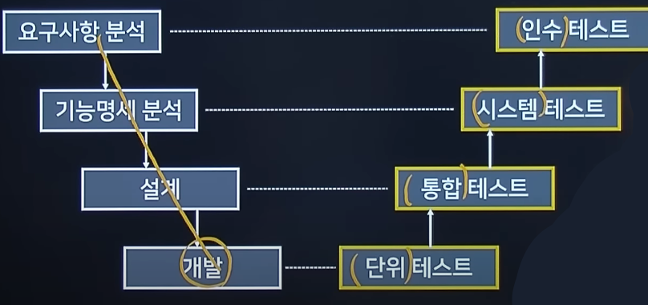
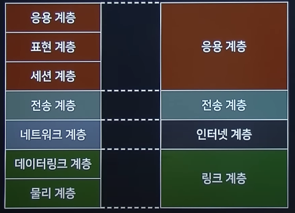

# Remind Keywords

## RARP

- RARP(Reverse Address Resolution Protocol - 역순 주소 결정 프로토콜)
  - IP호스트가 자신의 물리 네트워크 주소(MAC)는 알지만 IP주소를 모르는 경우, 서버로부터 IP주소를 요청하기 위해 사용한다.

## AC와 DAC

- AC(Access Control - 접근 통제)
  - 디렉토리나 파일, 네트워크 소켓 같은 시스템 자원을 적절한 권한을 가진 사용자나 그룹이 접근하고 사용할 수 있게 통제하는 것
- DAC(Discretionary Access Control - 임의 접근 통제)
  - 시스템 객체에 대한 접근을 사용자 또는 그룹의 신분을 기준으로 제한하는 방법
  - 사용자나 그룹이 객체의 소유자라면 다른 주체에 대해 이 객체에 대한 접근 권한을 설정할 수 있다.
- MAC(Mandatory Access Control - 강제 접근 통제)
  - 미리 정해진 정책과 보안 등급에 의거하여 주체에게 허용된 접근 권한과 객체에게 부여된 허용 등급을 비교하여 접근을 통제하는 모델
  - 높은 보안을 요구하는 정보는 낮은 보안 수준의 주체가 접근할 수 없으며, 소유자라고 할지라도 정책에 어긋나면 객체에 접근할 수 없으므로 강력한 보안을 제공한다.

## WSDL (Web Service Description Language)

> WSDL은 웹 서비스 기술언어 또는 기술된 정의 파일의 총징으로 XML로 기술된다. 웹 서비스의 구체적 내용이 기술되어 있어 서비스 제공 장소, 서비스 메시지 포맷, 프로토콜 등이 기술된다.

## SOAP (Simple Object Access Protocol)

> SOAP는 일반적으로 널리 알려진 HTTP, HTTPS, SMTP 등을 통해 XML 기반의 메시지를 컴퓨터 네트워크 상에서 교환하는 프로토콜이다. SOAP는 웹 서비스에서 기본적인 메시지를 전달하는 기반이 된다.

## IPC(Inter-Process Communication - 프로세스 간 통신)

> IPC란 프로세스들 사이에 서로 데이터를 주고받는 행위 또는 그에 대한 방법이나 경로를 뜻한다. IPC는 마이크로커널과 나노커널의 디자인 프로세스에 매우 중요하다. 마이크로커널은 커널이 제공하는 기능의 수를 줄여준다.

## 스푸핑(Spoofing)

- IP 스푸핑
  - IP 자체의 보안 취약성을 악용한 것으로 자신의 IP 주소를 속여서 접속하는 공격
  - IP 스푸핑을 통해 서비스 거부 공격(DoS)도 수행 가능하며, 공격 대상 컴퓨터와 서버 사이의 연결된 세션을 끊을 수도 있다.
  - 종단 인증(end point authentication) 같은 방법으로 해결한다.
- DNS 스푸핑
  - 공격대상에게 전달되는 DNS IP 주소를 조작하여 의도치 않는 주소로 접속하는 공격
  - 공격대상은 정상적인 URL을 통해서 접속하지만, 실제로 가짜 사이트로 접속된다.
- ARP 스푸핑
  - MAC 주소를 속여 랜에서의 통신 흐름을 왜곡시키는 공격.
  - 공격 대상 컴퓨터와 서버 사이의 트래픽을 공격자의 컴퓨터로 우회시켜 패스워드 정보 등 원하는 정보를 획득할 수 있다.

## 결합도 유형

|                        구분                         |                                                    설명                                                     |
| :-------------------------------------------------: | :---------------------------------------------------------------------------------------------------------: |
|  자료 결합도(결합도 가장 높음) (Data Coupling)   |                                  모듈 간의 인터페이스로 값이 전달되는 경우                                  |
|          스탬프 결합도 (Stamp Coupling)          |                    모듈 간의 인터페이스로 배열이나 오브젝트, 스트럭처 등이 전달되는 경우                    |
|          제어 결합도 (Control Coupling)          |        단순 처리할 대상인 값만 전달되는게 아니라 어떻게 처리를 해야 한다는 제어 요소가 전달되는 경우        |
|         외부 결합도 (External Coupling)          |                   어떤 모듈에서 선언한 데이터(변수)를 외부의 다른 모듈에서 참조하는 경우                    |
|          공통 결합도 (Common Coupling)           | 파라미터가 아닌 모듈 밖에 선언되어 있는 전역 변수를 참조하고 전역 변수를 갱신하는 식으로 상호 작용하는 경우 |
| 내용 결합도(결합도 가장 낮음) (Content Coupling) |                       다른 모듈 내부에 있는 변수나 기능을 다른 모듈에서 사용하는 경우                       |

## 응집도 유형

|                       구분                        | 설명                                                                                       |
| :-----------------------------------------------: | ------------------------------------------------------------------------------------------ |
|  기능적 응집도(응집도 가장 높음) (Functional)  | 모듈 내부의 모든 기능이 단일한 목적을 위해 수행되는 경우                                   |
|           순차적 응집도 (Sequential)           | 모듈 내에서 한 활동으로부터 나온 출력값을 다른 활동이 사용할 경우                          |
|         통신적 응집도 (Communication)          | 동일한 입력과 출력을 사용하여 다른 기능을 수행하는 활동들이 모여 있을 경우                 |
|           절차적 응집도 (Procedural)           | 모듈이 다수의 관련 기능을 가질 때 모듈 안의 구성 요소들이 그 기능을 순차적으로 수행할 경우 |
|            시간적 응집도 (Temporal)            | 연관된 기능이라기보다는 특정 시간에 처리되어야 하는 활동들을 한 모듈에서 처리할 경우       |
|            논리적 응집도 (Logical)             | 유사한 성격을 갖거나 특정 형태로 분류되는 처리 요소들이 한 모듈에서 처리되는 경우          |
| 우연적 응집도(응집도 가장 낮음) (Coincidental) | 모듈 내부의 각 구성 요소들이 연관이 없을 경우                                              |

## 파일의 구조

- 순차 파일(Sequential File, 순서 파일)
  - 순차 파일은 레코드를 논리적인 처리 순서에 따라 연속된 물리적 공간으로 기록하는 것
- 직접 파일(Direct File)
  - 파일을 구성하는 레코드를 임의의 물리적 저장공간에 기록하는 것
- 색인 순차 파일(Indexed Sequential File)

  - 순차 파일과 직접 파일에서 지원하는 편성 방법이 결합된 상태

  ## V 모델과 테스트 레벨

  

## 구조적 다이어그램(Structure Diagram)

- 클래스 다이어그램
  - 시스템을 구성하는 클래스들 사이의 관계를 표현한다.
- 패키지 다이어그램
  - 클래스나 유스 케이스 등을 포함한 여러 모델 요소들을 그룹화하여 패키지를 구성하고 패키지들 사이의 관계를 표현한다.
- 복합체 구조 다이어그램
  - 복합 구조의 클래스와 컴포넌트 내부 구조를 표현한다.
- 객체 다이어그램
  - 객체 정보를 보여준다.
- 컴포넌트 다이어그램
  - 컴포넌트 구조 사이의 관계를 표현한다.
- 배치 다이어그램
  - 소프트웨어, 하드웨어, 네트워크를 포함한 실행 시스템의 물리 구조를 표현한다.

## 행위 다이어그램(Behavior Diagram)

- 유스 케이스 다이어그램
  - 사용자 관점에서 시스템 행위를 표현한다.
- 활동 다이어그램
  - 업무 처리 과정이나 연산이 수행되는 과정을 표현한다.
- 콜라보레이션 다이어그램
  - 순차 다이어그램(Sequence Diagram)과 같으며 모델링 공간에 제약이 없어 구조적인 면을 중시한다.
- 상태 머신 다이어그램
  - 객체의 생명주기를 표현한다.
- 순차 다이어그램
  - 시간 흐름에 따른 객체 사이의 상호작용을 표현한다.
- 통신 다이어그램
  - 객체 사이의 관계를 중심으로 상호작용을 표현한다.
- 상호작용 개요 다이어그램
  - 여러 상호작용 다이어그램 사이의 제어 흐름을 표현한다.
- 타이밍 다이어그램
  - 객체 상태 변화와 시간 제약을 명시적으로 표현한다.

## 암호 방식의 분류

- 대칭키(비밀키)
  - Stream - LFSR, RC4
  - Block 방식 - DES, AES, IDEA
- 비대칭키(공개키)
  - 인수분해 이용 - RSA, Robin
  - 이산대수 - Elgamal, DSA
  - 타원곡선 - ECC

## UML 관계

- 일반화 관계(Generalization)
  - 한 클래스가 다른 클래스를 포함하는 상위 개념일 때의 관계
- 연산 관계(Accociation)
  - 2개 이상 사물이 서로 관련된 관계
- 의존 관계(Dependency)
  - 연관 관계와 같이 한 클래스가 다른 클래스에서 제공하는 기능을 사용할 때 표시
- 실체화 관계(Realization)
  - 한 객체가 다른 객체에게 오퍼레이션을 수행하도록 지정
- 집합 관계-집약 관계(Aggregation)
  - 한 객체가 다른 객체를 소유하는 'has a'관계
- 집합 관계-합성관계(Composition)
  - 부분 객체가 전체 객체에 속하는 관계로 긴밀한 필수적 관계

## OSI7 참조 모델

