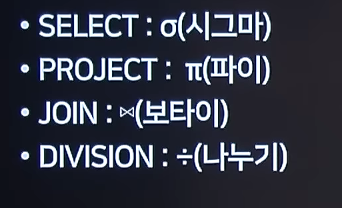
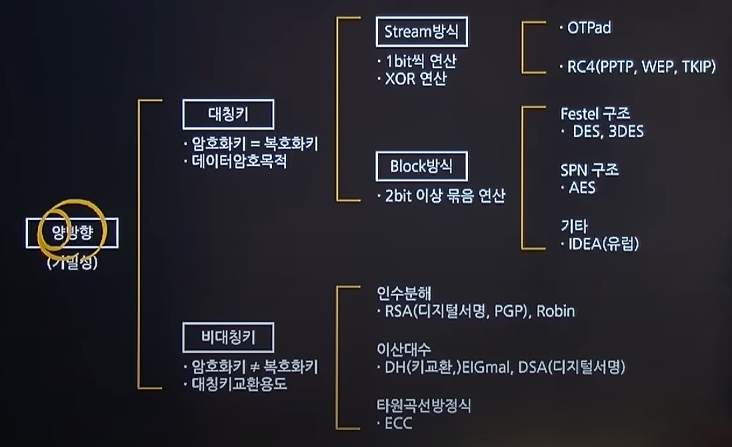
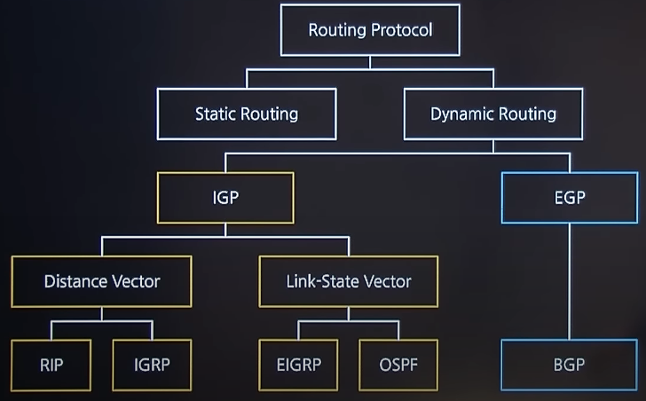
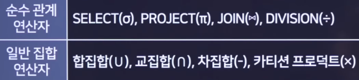

# Remind Keywords

## RAID(Redundant Array of Inexpensive/Independent Disk - 복수 배열 저가/독립 디스크) 형태

- RAID 1
  - 두 개 이상의 디스크를 미러링을 통해 하나의 디스크처럼 사용
- RAID 2
  - 오류 정정을 위한 해밍코드를 사용하는 방식
- RAID 3
  - 하나의 디스크를 패리티(Parity) 정보를 위해 사용하고 나머지 디스크에 데이터를 균등하게 분산 저장
- RAID 4
  - RAID 3과 같은 방식이나, 블록 단위로 분산 저장한다.
- RAID 5
  - 3개 이상의 디스크를 붙여서 하나의 디스크처럼 사용하고 각각의 디스크에 패리티 정보를 가지고 있는 방식
- RAID 6
  - 하나의 패리티를 두 개의 디스크에 분산 저장하는 방식

## 트랜잭션의 특성

- 원자성(Atomicity)
- 일관성(Consistency)
- 독립성, 격리성(Isolation)
- 영속성(Durability)

## 데이터베이스에서의 이상현상

- 삽입 이상 : 릴레이션에서 데이터를 삽입할 때 의도와는 상관없이 원하지 않는 값들로 함께 삽입되는 현상
- 삭제 이상 : 릴레이션에서 한 튜플을 삭제할 때 의도와는 상관없는 값들로 함께 삭제되는 연쇄 삭제 현상
- 갱신 이상 : 릴레이션에서 튜플에 있는 속성값을 갱신할 때 일부 튜플의 정보만 갱신되어 정보에 모순이 생기는 현상

## 데이터베이스 정규형

비정규 Relation

↓ 도메인이 원자값

제1정규형

↓ 부분 함수적 종속 제거

제2정규형

↓ 이행적 함수 종속 제거

제3정규형

↓ 결정자이면서 후보키가 아닌 것 제거

BCNF(Boyce-codd Normal Form)

↓ 다치 종속 제거

제4정규형

↓ 조인 종속성 이용

제5정규형

## UI 설계 원칙

- 직관성
  - 화면의 버튼, 항목, 입력란 등 누구나 쉽게 이해하고 사용할 수 있도록 한다.
- 유효성
  - 사용자의 목적을 정확히 달성할 수 있도록 유용하고 효과적이어야 한다.
- 학습성
  - 사용자가 쉽게 배우고 익힐 수 있어야 한다.
- 유연성
  - 사용자의 요구를 최대한 수용하면서 오류를 최소화해야 한다.

## 애플리케이션 테스트 유형 분류

- 프로그램 실행 여부
  - 정적 테스트
  - 동적 테스트
- 테스트 기법
  - 화이트박스 테스트
  - 블랙박스 테스트
- 테스트에 대한 시각
  - 검증 테스트
  - 확인 테스트
- 테스트 목적
  - 회복 테스트
  - 안전 테스트
  - 강도 테스트
  - 성능 테스트
  - 구조 테스트
  - 회귀 테스트
  - 병행 테스트
- 테스트 기반
  - 명세 기반 테스트
  - 구조 기반 테스트
  - 경험 기반 테스트

## 관계 대수

## 암호 방식에 따른 분류

## 블록암호 알고리즘

- AES
  - 128bit 평문을 128/192/256bit로 암호화
  - 키 크기에 따라 10/12/14회 Round 수행
  - 1997년 NIST에 의해 제정
  - 레인달(Rijndeal)에 기반한 암호화 방식
  - SPN 암호 방식을 사용한다.
- SEED
  - 순수 국내기술로 개발한 128비츠 및 256비트 대칭키 블록 암호 알고리즘
- ARIA
  - 국가 보안 기술 연구소(NSRI) 필두로 학계, 국가 정보원 등의 암호 기술 전문가들이 개발한 국가 암호화 알고리즘
  - AES 알고리즘과 똑같이 128/192/256비트 암호화키를 지원한다.
  - SPN 암호 방식을 사용한다.
- IDEA

  - 1990년 스위스에서 만들어진 PES를 개량하여 만들어진 블록 암호 알고리즘
  - 키길이가 128bit, 블록길이가 64bit
  - Feistel 방식과 SPN의 중간형태 구조

## 보안 솔루션

- 방화벽(Firwall)
  - 네트워크 간에 전송되는 정보를 선별하는 기능을 가진 침입 차단 시스템
- 웹 방화벽(Web Firewall)
  - 웹 기반 공격을 방어할 목적으로 만들어진 웹서버 특화 방화벽
- 침입탐지 시스템(IDS - Intrusion Detection System)
  - 컴퓨터 시스템의 비정상적인 사용, 오용 등을 실시간으로 탐지하는 시스템
  - 이상탐지, 오용탐지
- 침입방지 시스템(IPS - Intrusion Prevention System)
  - 방화벽과 침입탐지 시스템을 결합한 것
- 데이터유출방지(DLP - Data Leakage/Loss Prevention)
  - 내부 정보의 유출을 방지하기 위한 보안솔루션
- NAC(Network Access Control)
  - 네트워크에 접속하는 내부 PC의 MAC 주소(고유랜카드주소)를 IP관리 시스템에 등록한 후 일관된 보안관리 기능을 제공하는 보안솔루션
- ESM(Enterprise Security Management)
  - 다양한 장비에서 발생하는 로그 및 보안 이벤트를 통합관리 하는 보안 솔루션

## 라우팅 프로토콜

## 응집도(Cohesion)

|    응집도     | 내용                                                                      |
| :-----------: | ------------------------------------------------------------------------- |
| 기능적 응집도 | - 모듈 내부의 모든 기능이 단일한 목적을 위해 수행                         |
| 순차적 응집도 | - 모듈 내에서 한 활동으로부터 나온 출력값을 다른 활동이 사용              |
| 통신적 응집도 | - 동일한 입력과 출력을 사용하여 다른 기능을 수행                          |
| 절차적 응집도 | - 모듈 안의 구성 요소들이 기능을 순차적으로 수행하는 경우                 |
| 시간적 응집도 | - 특정 시간에 처리되어야 하는 활동을 한 모듈에서 처리                     |
| 논리적 응집도 | - 유사한 성격을 갖거나 특정 형태로 분류되는 처리요소들이 한 모듈에서 처리 |
| 우연적 응집도 | - 모듈 내부의 각 구성 요소들이 연관이 없는 경우                           |

## 결합도(Coupling)

|    결합도     | 내용                                                        |
| :-----------: | ----------------------------------------------------------- |
|  자료 결합도  | - 모듈간의 자료(값)를 통해서만 모듈 상호 작용 발생          |
| 스탬프 결합도 | - 모듈간의 배열이나 오브젝트, 스트럭처 등이 전달되는 경우   |
|  제어 결합도  | - 값만 전달되는게 아니라, 제어 요소가 전달 되는 경우        |
|  외부 결합도  | - 모듈에서 외부로 선언한 변수를 다른 모듈에서 참조          |
|  공통 결합도  | - 전역변수를 참조                                           |
|  내용 결합도  | - 다른 모듈 내부에 있는 변수나 기능을 또 다른 모듈에서 사용 |

## 객체지향 설계원칙(SOLID)

- 단일 책임 원칙(SRP, Single Responsibility Principle)
  - 한 클래스는 하나의 책임만을 가져야 한다.
- 개방 폐쇄 원칙(OCP, Open-Close Principle)
  - 확장에는 열려 있고, 수정에는 닫혀 있어야 한다.
- 리스코프 치환 원칙(LSP, Liskov substitution principle)
  - 자식 클래스는 언제나 자신의 부모 클래스를 대체할 수 있어야 한다.
- 인터페이스 분리 원칙(ISP, Interface Segregation Principle)
  - 자신이 사용하지 않는 인터페이스는 구현하지 말아야 한다.
- 의존성 역전 원칙(DIP, Dependency Inversion Principle)
  - 의존 관계를 맺을 때 자주 변화하는 것보다, 변화가 거의 없는 것에 의존해야 한다.

## UI 설계 원칙

- 직관성 : 화면의 버튼, 항목, 입력란 등 누구나 쉽게 이해하고 사용할 수 있도록 한다.
- 유효성 : 사용자의 목적을 정확히 달성할 수 있도록 유용하고 효과적이어야 한다.
- 학습성 : 사용자가 쉽게 배우고 익힐 수 있어야 한다.
- 유연성 : 사용자의 요구를 최대한 수용하면서 오류를 최소화해야 한다.

## 데이터베이스 이상현상

- 삽입 이상 : 릴레이션에서 데이터를 삽입할 때 의도와는 상관없이 원하지 않는 값들로 함께 삽입되는 현상
- 삭제 이상 : 릴레이션에서 한 튜플을 삭제할 때 의도와는 상관없는 값들로 함께 삭제되는 연쇄 삭제 현상
- 갱신 이상 : 릴레이션에서 튜플에 있는 속성값을 갱신할 때 일부 튜플의 정보만 갱신되어 정보에 모순이 생기는 현상

## 데이터베이스 정규화

비정규 Relation

↓ 도메인이 원자값

제1정규형

↓ 부분 함수정 종속 제거

제2정규형

↓ 이행적 함수 종속 제거

제3정규형

↓ 결정자이면서 후보키가 아닌 것 제거

BCNF(Boyce-Codd Normal Form)

↓ 다치 종속 제거

제4정규형

↓ 조인 종속성 이용

제5정규형

## 형상관리 절차

1. 형상 식별
2. 형상 통제
3. 형상 감사
4. 형상 기록

- 통제 : 소프트웨어 형상 변경 요청을 검토하고 승인하여 현재의 베이스라인에 반영될 수 있도록 통제

## 관계

- 일반화 관계(Generalization)
  - 한 클래스가 다른 클래스를 포함하는 상위 개념일 때의 관계
- 연관관계(Accociation)
  - 한 클래스가 다른 클래스에서 제공하는 기능을 사용할 때의 표시
- 의존관계(Dependency)
  - 클래스의 관계가 한 메서드를 실행하는 동안과 같이 매우 짧은 시간만 유지
- 실체화 관계(Realization)
  - 인터페이스를 구현받아 추상 메서드를 오버라이딩하는 의미
- 집약관계(Aggregation)
  - 전체 객체의 라이프타임과 부분 객체의 라이프타임은 독립적
- 합성관계(Composition)
  - 부분 객체가 전체 객체에 속하는 관계로 긴밀한 필수적 관계

## 유스케이스 다이어그램 관계

- 연관관계(Association)
  - 유스케이스와 액터 간의 상호작용이 있음을 표현
- 포함관계(Include)
  - 유스케이스를 수행할 때 반드시 실행되어야 하는 경우
- 확장 관계(Extend)
  - 유스케이스를 수행할 때 특정 조건에 따라 확장 기능 유스케이스를 수행하는 경우

## 블랙박스 테스트

- 동등 분할 기법(Equivalence Partitioning)
  - 입력 자료에 초점을 맞춰 테스트 케이스를 만들어 검사하는 방법
- 경계값 분석(Boundary value Analysis)
  - 입력 조건의 경계값을 테스트 케이스로 선정하는 방법
- 원인-효과 그래프 검사(Cause Effect Graph)
  - 입력 데이터 간의 관계와 출력에 영향을 미치는 상황을 체계적으로 분석한 다음 효용성이 높은 테스트 케이스를 선정하여 검사하는 기법
- 오류 예측 검사(Error Guessing)
  - 과거의 경험이나 테스터의 감각으로 테스트하는 기법
- 비교 검사(Comparision Testing)
  - 여러 버전의 프로그램에 동일한 테스트 자료를 제공하여 동일한 결과가 출력되는지 테스트하는 기법

## 애플리케이션 테스트 유형 분류

- 프로그램 실행 여부
  - 정적 테스트
  - 동적 테스트
- 테스트 기법
  - 화이트박스 테스트
  - 블랙박스 테스트
- 테스트에 대한 시각
  - 검증 테스트
  - 확인 테스트
- 테스트 목적
  - 회복 테스트
  - 안전 테스트
  - 강도 테스트
  - 성능 테스트
  - 구조 테스트
  - 회귀 테스트
  - 병행 테스트
- 테스트 기반
  - 명세 기반 테스트
  - 구조 기반 테스트
  - 경험 기반 테스트

## SSO(통합 인증)

> SSO(Same Sign-on - 통합 인증)란 한 번의 인증 과정으로 여러 컴퓨터 상의 자원을 이용 가능하게 하는 인증 기능이다. 싱글 사인온, 단일 계정 로그인, 단일 인증이라고 한다.

## 스케줄링 기법

### 선점형 기법

- RR(Round Robin)
- SRT(Shortest Remaining Time)
- 다단계 큐(MLQ, Multi-Level Queue)
- 다단계 피드백 큐(MLFQ, Multi-Level Feedback Queue)

### 비 선점형 기법

- FCFS(First Come First Serve)
- SJF(Shortest Job First)
- HRN(Highest Response Ratio Next)
- 우선순위(Priority)
- 기한부(Deadline)

## SIEM(Security Information and Event Management) 보안

> SIEM란? 소프트웨어 제품 및 서비스가 보안 정보 관리와 보안 이벤트 관리를 결합하는 컴퓨터 보안의 한 분야로, 애플리케이션 및 네트워크 하드웨어에서 생성된 보안 경고에 대한 실시간 분석을 제공한다. 빅데이터 수준의 데이터를 장시간 심층 분석한 인덱싱 기반이며 주요기능은 데이터 통합, 상관관계, 알림, 대시보드 등이 있다.

## 관계대수 연산자

