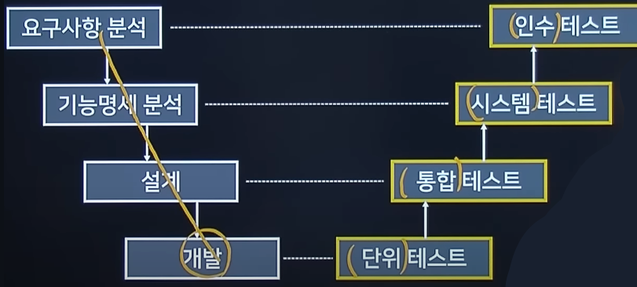
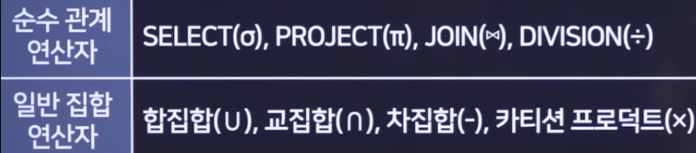
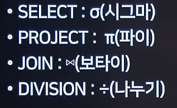
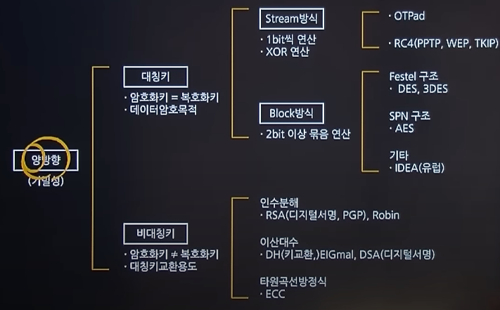
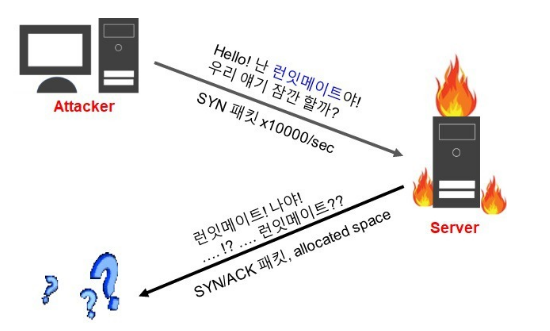
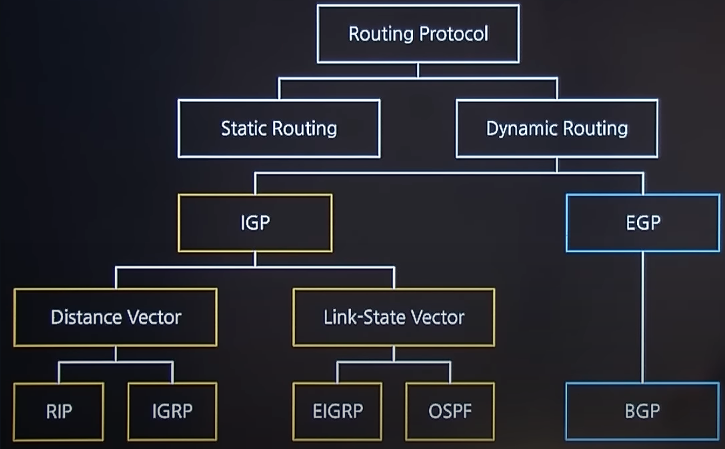
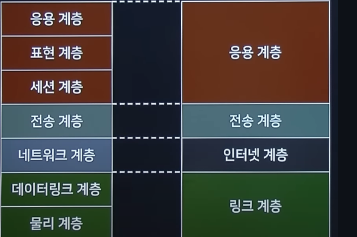

# 실기 기출 종합 키워드 2020-2022

# SW 기본

## 인터페이스 전송 데이터

- JSON(JavaScript Object Notation)
  - Javascript 객체 문법으로 구조화된 데이터를 표현하기 위한 문자 기반의 표준 포맷
  - JSON 데이터는 이름과 값의 쌍으로 이루어진다.
- XML(eXtensible Markup Language)
  - 웹에서 구조화한 문서를 표현하고 전송하도록 설계한 마크업 언어
- CSV(Comma Separated Values)
  - 몇 가지 필드를 쉼표(,)로 구분한 텍스트 데이터 및 텍스트 파일
- YAML
  - XML, C, 파이썬, 펄, RFC2822에서 정의된 e-mail 양식에서 개념을 얻어 만들어진 '사람이 쉽게 읽을 수 있는' 데이터 직렬화 양식

## REST

- 자원을 이름(자원의 표현)으로 구분하여 해당 자원의 상태(정보)를 주고 받는 모든 것
- HTTP URI를 통해 자원(Resource)을 명시하고, HTTP Method(POST, GET, PUT, DELETE)를 통해 해당 자원에 대한 CRUD Operation을 적용하는 것을 의미한다.
- RESTful : REST라는 아키텍처를 구현하는 웹 서비스

## 시맨틱 웹

- 의미론적인 웹, 즉 문서의 의미에 맞게 애플리케이션의 의미에 맞게 구성된 웹
- 컴퓨터가 사람을 대신하여 정보를 읽고, 이해하고 가공하여 새로운 정보를 만들어 낼 수 있도록 이해하기 쉬운 의미를 가진 차세대 지능형 웹

## SSO(통합 인증)

> SSO(Same Sign-on - 통합 인증)란 한 번의 인증 과정으로 여러 컴퓨터 상의 자원을 이용 가능하게 하는 인증 기능이다. 싱글 사인온, 단일 계정 로그인, 단일 인증이라고 한다.

## 프로토콜의 기본 3요소

- 구문 : 데이터의 구조나 형태와 포맷을 정의한다.
- 타이밍 : 어떤 데이터를 보낼 것인지, 얼마나 빨리 보낼 것인지를 결정한다.
- 의미 : 데이터의 각 부분이 무엇을 뜻하는지 알 수 있게 미리 정해둔 규칙이다.

## 프로세스 스케줄링 ★★★

- **비선점 스케줄링**
  - FCFS(First Come First Service)
    - 먼저 들어간 것을 먼저 실행한다.
  - SJF(Shortest Job First)
    - 진행 중인 프로세스를 멈추지는 않는다.
    - CPU 점유 시간이 가장 짧은 프로세스에 CPU를 먼저 할당하는 방식으로, 평균 대기시간을 최소로 만드는 것을 최적으로 두고 있는 알고리즘이다.
  - HRN(Highest Response Ratio Next)
    - 최고응답률 계산식 : (대기시간 + 서비스시간) / 서비스시간
    - 최고응답률의 값이 큰 순으로 우선순위를 정하는 방식
  - 기한부(Deadline)
    - 작업들이 명시된 기간이나 기한 내에 완료되도록 계획
  - 우선순위(Priority)
    - 우선순위 스케줄링은 각 프로세스의 우선순위가 정해지면, 우선순위가 제일 높은 프로세스에게 CPU를 할당하되, 우선순위가 같은 경우에는 FCFS 방식을 적용한다.
    - 일반적인 연산 위주 프로세스보다 입출력 위주 프로세스에게 높은 우선순위를 부여하여 대화성을 증진시킨다.
- **선점 스케줄링**
  - SRT(Shortest Remaining Time Scheduling)
    - 최단 잔여시간을 우선으로 하는 스케줄링 기법으로, 진행 중인 프로세스가 있어도, 최단 잔여시간인 프로세스를 위해 sleep 시키고 짧은 프로세스를 먼저 할당한다.
  - RR(Round Robin Scheduling)
    - 시분할 시스템을 위해 설계되었다.
    - FCFS(FIFO) 알고리즘을 선점 형태로 변형한 기법이다.
    - 준비 큐를 원형 큐로 간주하고 순환식으로 각 프로세스에게 작은 단위의 시간량(타임 퀀텀)만큼씩 CPU를 할당하는 방식이다.
    - FCFS 기법과 같이 준비상태 큐에 먼저 들어온 프로세스가 먼저 CPU를 할당받지만, 각 프로세스는 시간 할당량(Time Slice, Quantum) 동안만 실행한 후 실행이 완료되지 않으면 다음 프로세스에게 CPU를 넘겨주고 준비상태 큐의 가장 뒤로 배치된다.
    - 이론상 n개의 프로세스가 1/n의 속도로 동시에 실행된다.
    - 일반적으로 평균 반환시간이 SJF보다 크지만, 프로세스가 공정하게 기회를 얻게 되어 기아상태가 발생하지는 않는다.
    - 타임 퀀텀의 크기가 작으면 잦은 문맥 교환 오버헤드 증가로 처리율이 감소할 수 있으며, 성능은 타임 퀀텀의 크기에 많은 영향을 받는다.
    - 할당되는 시간의 크기가 작으면 작은 프로세스들에게 유리하다.
  - MLQ(Multi-Level Queue - 다단계 큐)
  - MLFQ(Multi-Level Feedback Queue - 다단계 피드백 큐)

# SW 설계/개발

## 형상관리 절차

- 형상 식별 -> 형상 통제 -> 형상 감사 -> 형상 기록

※ 버전 관리 도구 분류

- 공유 폴더 방식
  - SCCS, RCS, PVCS
- 클라이언트/서버 방식
  - CVS, SVN, Clear Case
- 분산 저장소 방식
  - Git, Gnu arch, Bazaar, Bitkeeper

## 형상 관리/형상 통제

- 소프트웨어 형상 변경 요청을 검토하고 승인하여 현재의 베이스라인에 반영될 수 있도록 통제하는 것을 의미한다.
- 형상관리 절차 : 형상 식별 -> 형상 통제 -> 형상 감사 -> 형상 기록
- 통제 : 소프트웨어 형상 변경 요청을 검토하고 승인하여 현재의 베이스라인에 반영될 수 있도록 통제

## UI의 설계 원칙

| 설계 원칙 |                              설명                              |
| :-------: | :------------------------------------------------------------: |
|  직관성   |          누구나 쉽게 이해하고 사용할 수 있어야 한다.           |
|  유효성   |           사용자의 목적을 정확하게 달성하여야 한다.            |
|  학습성   |            누구나 쉽게 배우고 익힐 수 있어야 한다.             |
|  유연성   | 사용자의 요구사항을 최대한 수용하며, 오류를 최소화하여야 한다. |

## 객체지향 설계원칙(SOLID)

- 단일 책임 원칙(SRP, Single Responsibility Principle)
  - 한 클래스는 하나의 책임만을 가져야 한다.
- 개방 폐쇄 원칙(OCP, Open-Close Principle)
  - 확장에는 열려 있고, 수정에는 닫혀 있어야 한다.
- 리스코프 치환 원칙(LSP, Liskov substitution principle)
  - 자식 클래스는 언제나 자신의 부모 클래스를 대체할 수 있어야 한다.
- 인터페이스 분리 원칙(ISP, Interface Segregation Principle)
  - 자신이 사용하지 않는 인터페이스는 구현하지 말아야 한다.
- 의존성 역전 원칙(DIP, Dependency Inversion Principle)
  - 의존 관계를 맺을 때 자주 변화하는 것보다, 변화가 거의 없는 것에 의존해야 한다.

## 릴리즈 노트 작성 항목

|                    |                                                                                        |
| :----------------: | -------------------------------------------------------------------------------------- |
| 머리말 (Header) | 릴리즈 노트명, 제품 이름, 작성일, 릴리즈 노트 버전 등의 정보 고지                      |
|        개요        | 소프트웨어 및 변경사항에 관한 간략하고 전반적인 내용                                   |
|        목적        | 해당 릴리즈 버전에서의 새로운 기능, 수정된 기능, 릴리즈 노트의 목적에 대한 간략한 개요 |
|  이슈(문제) 요약   | 발견된 문제에 대한 요약                                                                |
|     재현 항목      | 버그 발견에 대한 재현 단계 기술                                                        |
|   수정/개선 내용   | 발견된 버그의 수정/개선 사항을 간단히 기술                                             |

## UML 관계

- 일반화 관계(Generalization)
  - 한 클래스가 다른 클래스를 포함하는 상위 개념일 때의 관계
- 연산 관계(Accociation)
  - 2개 이상 사물이 서로 관련된 관계
  - 한 클래스가 다른 클래스에서 제공하는 기능을 사용할 때의 표시
- 의존 관계(Dependency)
  - 연관 관계와 같이 한 클래스가 다른 클래스에서 제공하는 기능을 사용할 때 표시
  - 클래스의 관계가 한 메서드를 실행하는 동안과 같이 매우 짧은 시간만 유지
- 실체화 관계(Realization)
  - 한 객체가 다른 객체에게 오퍼레이션을 수행하도록 지정
  - 인터페이스를 구현받아 추상 메서드를 오버라이딩하는 의미
- 집합 관계-집약 관계(Aggregation)
  - 한 객체가 다른 객체를 소유하는 'has a'관계
  - 전체 객체의 라이프타임과 부분 객체의 라이프타임은 독립적
- 집합 관계-합성관계(Composition)
  - 부분 객체가 전체 객체에 속하는 관계로 긴밀한 필수적 관계

## 유스케이스 다이어그램 관계

- 연관관계(Association)
  - 유스케이스와 액터 간의 상호작용이 있음을 표현
- 포함관계(Include)
  - 유스케이스를 수행할 때 반드시 실행되어야 하는 경우
- 확장 관계(Extend)
  - 유스케이스를 수행할 때 특정 조건에 따라 확장 기능 유스케이스를 수행하는 경우

## 결합도 유형

|                          구분                           |                                                  설명                                                  |
| :-----------------------------------------------------: | :----------------------------------------------------------------------------------------------------: |
|  자료 결합도 (Data Coupling) (결합도 가장 낮음)   |                                모듈간의 인터페이스로 값이 전달되는 경우                                |
|            스탬프 결합도 (Stamp Coupling)            |                 모듈 간의 인터페이스로 배열이나 오브젝트, 스트럭처 등이 전달되는 경우                  |
|            제어 결합도 (Control Coupling)            |     단순 처리할 대상인 값만 전달되는게 아니라 어떻게 처리를 해야 한다는 제어 요소가 전달되는 경우      |
|           외부 결합도 (External Coupling)            |                 어떤 모듈에서 선언한 데이터(변수)를 외부의 다른 모듈에서 참조하는 경우                 |
|            공통 결합도 (Common Coupling)             | 파라미터가 아닌 모듈 밖에서 선언된 전역 변수를 참조하고 전역 변수를 갱신하는 식으로 상호 작용하는 경우 |
| 내용 결합도 (Content Coupling) (결합도 가장 높음) |                    다른 모듈 내부에 있는 변수나 기능을 다른 모듈에서 사용하는 경우                     |

## 응집도 유형

|                         구분                          |                                            설명                                            |
| :---------------------------------------------------: | :----------------------------------------------------------------------------------------: |
| 우연적 응집도 (Coincidental) (응집도 가장 낮음) |                       모듈 내부의 각 구성 요소들이 연관이 없을 경우                        |
|              논리적 응집도 (Logicla)               |     유사한 성격을 갖거나 특정 형태로 분류되는 처리 요소들이 한 모듈에서 처리되는 경우      |
|              시간적 응집도 (Temporal)              |    연관된 기능이라기보다는 특정 시간에 처리되어야 하는 활동들을 한 모듈에서 처리할 경우    |
|             절차적 응집도 (Procedural)             | 모듈이 다수의 관련 기능을 가질 때 모듈 안의 구성 요소들이 그 기능을 순차적으로 수행할 경우 |
|           통신적 응집도 (Communication)            |         동일한 입력과 출력을 사용하여 다른 기능을 수행하는 활동들이 모여 있는 경우         |
|             순차적 응집도 (Sequential)             |             모듈 내에서 한 활동으로부터 나온 출력값을 다른 활동이 사용할 경우              |
|  기능적 응집도 (Functional) (응집도 가장 높음)  |                  모듈 내부의 모든 기능이 단일한 목적을 위해 수행되는 경우                  |

# 테스트

## 소프트웨어 테스트의 원리

- 테스팅은 결함이 존재함을 밝히는 활동이다.
- 완벽한 테스팅은 불가능하다.
- 테스팅은 개발 초기에 시작해야 한다.
- 결함 집중(파레토 원칙)
  - 많은 성과에서 결과의 약 80%가 20%의 원인에서 발생한다
- 살충제 패러독스
  - 동일한 테스트로 동일한 절차를 반복 수행하면 새로운 결함을 찾을 수 없다.
- 테스팅은 정황(Context)에 의존한다.
- 오류 - 부재의 궤변
  - 결함이 없어도, 요구사항을 충족시켜주지 못한다면 해당 소프트웨어의 품질이 높다고 할 수 없다

## 애플리케이션 테스트 유형 분류

- 프로그램 실행 여부
  - 정적 테스트(실행하지 않고 행하는 테스트)
  - 동적 테스트(실행하면서 확인하는 테스트)
- 테스트 기법
  - 화이트박스 테스트
    - 소스코드를 보면서 실행시킴
    - 제어흐름(조건문, 반복문), 데이터 흐름(변수, 자료구조), 분기, 경로 테스트 등이 있음
  - 블랙박스 테스트
    - 기능/부분적인 코드 실행을 통한 테스트
    - 원인-효과 그래프 검사 : 입력 데이터 간의 관계와 출력에 영향을 미치는 상황을 체계적으로 분석한 다음 효용성이 높은 테스트 케이스를 선정하여 검사하는 기법
    - 경계값 검사 : 입력 조건의 경계값을 테스트 케이스로 선정하는 방법
    - 비교 검사 : 여러 버전의 프로그램에 동일한 테스트 자료를 제공하여 동일한 결과가 출력되는지 테스트하는 기법
    - 동등 분할 기법 : 입력 자료에 초점을 맞춰 테스트 케이스를 만들어 검사하는 방법
    - 오류 예측 검사 : 과거의 경험이나 테스터의 감각으로 테스트하는 기법
- 테스트에 대한 시각
  - 검증 테스트(개발자 테스트)
  - 확인 테스트(사용자 테스트)
- 테스트 목적
  - 회복 테스트 : 소프트웨어가 다양한 방법으로 실패하도록 유도하고 회복이 적절하게 수행되는지를 검증하면서 회복이 시스템에 의해 자동으로 수행되면 재초기화, 데이터회복, 재시작 방법 등에 의해 정상적으로 회복되는지를 평가
  - 안전 테스트 : 안전성 검증
  - 강도 테스트 : stress test - 과다한 정보량 투입
  - 성능 테스트 : 응답속도, 처리량 등을 측정
  - 구조 테스트 : 내부 논리경로, 복잡도 평가
  - 회귀 테스트 : 변경 또는 교정이 새로운 오류를 발생시키는지 여부 확인
  - 병행 테스트 : 변경 전과 변경 후 프로그램을 동등한 데이터로 테스트하여 결과 비교
- 테스트 기반
  - 명세 기반 테스트
  - 구조 기반 테스트
  - 경험 기반 테스트

## 코드 커버리지(Code Coverage)

- 구문 커버리지
  - 코드 구조 내의 모든 구문에 대해 한 번 이상 수행하는 테스트 커버리지
- 조건 커버리지
  - 결정 포인트 내의 모든 개별 조건식에 대해 수행하는 테스트 커버리지
- 결정 커버리지
  - 결정 포인트 내의 모든 분기문에 대해 수행하는 테스트 커버리지
- 조건/결정 커버리지
  - 결정포인트 T/F, 개별조건식 T/F를 가져야 한다.
- 변경/조건 커버리지
  - 모든 결정 포인트 내의 개별 조건식은 적어도 한 번 T, F를 가져야 한다.
- 다중 조건 커버리지
  - 결정 포인트 내 모든 개별 조건식의 가능한 조합을 100% 보장해야 한다.

## V 모델과 테스트 레벨

# 데이터베이스

## 반정규화의 유형

|     구분      |       유형       | 설명                      |
| :-----------: | :--------------: | ------------------------- |
|  테이블 분할  |     수평분할     | - 레코드 단위로 분할      |
|               |     수직분할     | - 컬럼 단위로 분할        |
|  테이블 중복  | 통계 테이블 추가 | - DW,OLAP 데이터용        |
|               | 진행 테이블 추가 | - 업무 프로세스 상태      |
| 컬럼기반 분할 |  조회 빈도 기반  | - 고빈도 컬럼 분리        |
|               |  크기 기반 분할  | - 일정 용량 컬럼 분리     |
|   컬럼 중복   |  중복 컬럼 추가  | - 자주 조회되는 컬럼 추가 |
|               |  파생 컬럼 추가  | - 연산 결과 별도 저장     |

## 데이터베이스 스키마

- 외부 스키마
  - VIEW와 연계돼있으며 여러 개가 존재할 수 있다.
- 개념 스키마
  - 데이터베이스의 전체적인 구조와 제약조건을 의미한다.
- 내부 스키마
  - 저장장치 입장에서 본 구조
- 논리적 독립성 : 개념 스키마나 내부 스키마가 바뀌어도 외부 스키마에 영향을 주지 않는다.
- 물리적 독립성 : 내부 스키마가 바뀌어도 개념 스키마와 외부 스키마에 영향을 주지 않는다.

## SQL 기본문법

SELECT

\*, a, b

FROM [테이블명]

WHERE ~~

AND/OR ~~

GROUP BY [속성]

having ~~

ORDER BY [컬럼] ASC/DESC

## SQL ALTER

- 속성 추가
  - ALTER TABLE [테이블 이름] ADD [속성명] [데이터 타입];
- 속성 변경
  - ALTER TABLE [테이블 이름] MODIFY [속성명] [데이터 타입];
- 속성 삭제
  - ALTER TABLE [테이블 이름] DROP [속성명] [데이터 타입];

## 관계대수 연산자

|                  |                                                            |
| :--------------: | ---------------------------------------------------------- |
| 순수 관계 연산자 | SELECT(∑-시그마), PROJECT(π - 파이), JOIN(▶◀), DIVISION(÷) |
| 일반 집합 연산자 | 합집합(∪), 교집합(∩), 차집합(-), 카티션 프로덕트(×)        |

- SELECT : 릴레이션에서 조건을 만족하는 수평적 부분 집합(튜플)을 구하기 위한 연산

- PROJECT : 릴레이션에서 수직적 부분으로 집합(속성의 값)을 구하는 연산으로 원하는 속성을 추출하기 위한 연산.

- JOIN : 두 테이블로부터 조건에 맞는 관련된 튜플들을 하나의 튜플로 결합하여 하나의 테이블로 만드는 연산

- DIVISION : A, B 두 테이블에 대해 'A DIVISION B'는 B 테이블의 조건을 만족하는 튜플들을 테이블 A에서 추출하는 연산

### 관계 대수

## 구조적 다이어그램(Structure Diagram)

- 클래스 다이어그램
  - 시스템을 구성하는 클래스들 사이의 관계를 표현한다.
- 패키지 다이어그램
  - 클래스나 유스케이스 등을 포함한 여러 모델 요소들을 그룹화하여 패키지를 구성하고 패키지들 사이의 관계를 표현한다.
- 복합체 구조 다이어그램
  - 복합 구조의 클래스와 컴포넌트 내부 구조를 표현한다.
- 객체 다이어그램
  - 객체 정보를 보여준다.
- 컴포넌트 다이어그램
  - 컴포넌트 구조 사이의 관계를 표현한다.
- 배치 다이어그램
  - 소프트웨어, 하드웨어, 네트워크를 포함한 실행 시스템의 물리 구조를 표현한다.

## 행위 다이어그램(Behavior Diagram)

- 유스 케이스 다이어그램
  - 사용자 관점에서 시스템 행위를 표현한다.
- 활동 다이어그램
  - 업무 처리 과정이나 연산이 수행되는 과정을 표현한다.
- 콜라보레이션 다이어그램
  - 순차 다이어그램(Sequence Diagram)과 같으며, 모델링 공간에 제약이 없어 구조적인 면을 중시한다.
- 상태 머신 다이어그램
  - 객체의 생명주기를 표현한다.
- 순차 다이어그램
  - 시간 흐름에 따른 객체 사이의 상호작용을 표현한다.
- 통신 다이어그램
  - 객체 사이의 관계를 중심으로 상호작용을 표현한다.
- 상호작용 개요 다이어그램
  - 여러 상호작용 다이어그램 사이의 제어 흐름을 표현한다.
- 타이밍 다이어그램
  - 객체 상태 변화와 시간 제약을 명시적으로 표현한다.

## 테스트 오라클

- 휴리스틱(Heuristic) 오라클
  - 임의의 입력값에 대해 올바른 결과를 제공하고, 나머지 값들에 대해서는 휴리스틱(추정)으로 처리
- 참(True) 오라클
  - 모든 입력값에 적합한 결과를 생성하여, 발생한 오류를 모두 검출
- 일관성 검사(Consistent) 오라클
  - 애플리케이션 변경이 있을 때, 수행 전과 후의 결과값이 같은지 확인
- 샘플링(Sampling) 오라클
  - 임의로 선정한 몇 개의 입력값에 대해서만 기대하는 결과를 제공

## 데이터베이스 정규화

비정규 릴레이션

↓ 도메인이 원자값

제1정규형

↓ 부분적 함수 종속 제거

제2정규형

↓ 이행적 함수 종속 제거

제3정규형

↓ 결정자이면서 후보키가 아닌 것 제거

BCNF

↓ 다치 종속 제거

제4정규형

↓ 조인 종속성 이용

제5정규형

## 데이터베이스 회복 기법

- 즉시 갱신 기법
  - 트랜잭션이 실행(활동) 상태에서 변경되는 내용을 그때그때 바로 데이터베이스에 적용하는 기법
  - 변경되는 모든 내용은 로그(Log)에 기록하여 장애 발생 시 로그(Log)의 내용을 토대로 회복
  - Redo, Undo 모두 수행
- 지연 갱신 기법
  - 트랜잭션이 수행되어 부분완료 될 때까지 데이터베이스에 적용하지 않고 지연시킨 후 부분완료가 되면 로그(Log)의 내용을 토대로 데이터베이스에 적용하는 기법
  - Redo만 수행
- 검사점 회복 기법(Checkpoint Recovery)
  - 트랜잭션이 실행되는 중간에 검사 시점(Check Point)을 지정하여 검사 시점까지 수행 후 완료된 내용을 데이터베이스에 적용하는 기법
- 그림자 페이징(Shadow Paging) 기법
  - 로그(Log)를 사용하지 않고, 데이터베이스를 동일한 크기의 단위인 페이지로 나누어 각 페이지마다 복사하여 그림자 페이지를 보관
  - 데이터베이스의 변경되는 내용은 원본 페이지에만 적용하고, 장애가 발생되는 경우 그림자 페이지를 이용해 회복

## 데이터베이스에서의 이상현상

- 삽입 이상 : 릴레이션에서 데이터를 삽입할 때 의도와는 상관없이 원하지 않는 값들로 함께 삽입되는 현상
- 삭제 이상 : 릴레이션에서 한 튜플을 삭제할 때 의도와는 상관없는 값들로 함께 삭제되는 연쇄 삭제 현상
- 갱신 이상 : 릴레이션에서 튜플에 있는 속성값을 갱신할 때 일부 튜플의 정보만 갱신되어 정보에 모순이 생기는 현상

## 트랜젝션의 특성

> 트랜젝션이란, 데이터베이스에서 하나의 그룹으로 처리되어야 하는 명령문들을 모아 놓은 논리적인 작업 단위이다. 여러 개의 명령어의 집합이 정상적으로 처리되면 정상 종료되며, 하나의 명령어라도 잘못되면 전체가 롤백된다.

### 트랜잭션을 사용하는 이유

- 데이터의 일관성을 유지하면서 안정적으로 데이터를 복구하기 위해 사용한다.
- 데이터베이스에서는 테이블에서 데이터를 읽어 온 후 다른 테이블에 데이터를 입력하거나 갱신, 삭제하는데 처리 도중 오류가 발생하면 모든 작업을 원상태로 되돌린다. 처리 과정이 모두 성공했을 때만 최종적으로 데이터베이스에 반영한다.

### 트랜잭션의 특징(ACID)

- 원자성(Atomicity)
  - 트랜잭션과 관련된 작업들이 부분적으로 실행되다가 중단되지 않는 것을 보장하는 능력
  - 트랜잭션이 DB에 모두 반영되거나 전혀 반영되지 않는 것. (All or Nothing)
- 일관성(Consistency)
  - 트랜잭션이 실행을 성공적으로 완료하면 언제나 일관성 있는 데이터베이스 상태로 유지하는 것을 의미한다.
  - 만약 무결성 제약이 모든 계좌는 잔고가 있어야 한다면 이를 위반하는 트랜잭션은 중단된다.
- 독립성(Isolation)
  - 트랜잭션 수행 시 다른 트랜잭션의 연산 적업이 끼어들지 못하도록 보장하는 것을 의미한다.
  - 이것은 트랜잭션 밖에 있는 어떤 연산도 중간 단계의 데이터를 볼 수 없음을 의미한다. 제 3자가 도중에 쿼리를 실행하더라도 특정 계좌간 이체하는 양 쪽 데이터에 접근할 수 없다.
- 지속성(Durability)
  - 성공적으로 수행된 트랜잭션은 영원히 반영되어야 함을 의미한다. 즉, 시스템 문제, DB 일관성 체크 등을 하더라도 유지되어야 함을 의미한다.
  - 전형적으로 모든 트랜잭션은 로그로 남고 시스템 장애 발생 전 상태로 되돌릴 수 있다. 트랜잭션은 로그에 모든 것이 저장된 후에만 commit 상태로 간주될 수 있다.

## 데이터베이스 무결성

- 개체 무결성(Entity Integrity)
  - 고유 키(유일 키)의 개념과 관련되며, 개체 무결성은 모든 테이블이 기본 키(primary key)를 가져야 하며 기본 키로 선택된 열은 고유하여야 하며 빈 값은 허용하지 않음을 규정한다.**(Not Null 제약조건)**
- 참조 무결성(Referential Integrity)
  - 외래 키(외부 키)의 개념과 관련되며, 참조 무결성 규칙은 모든 외래 키 값은 두 가지 상태 가운데 하나에만 속함을 규정한다.
  - 일반적인 상태는 외래 키 값이 데이터베이스의 특정 테이블의 기본 키 값을 참조하는 것이다. 이는 비즈니스의 규칙에 따라 달라질 수 있으며 외래 키 값은 빈 값을 허용한다.
  - **릴레이션 R1에 속성 조합인 외래키를 변경하려면 이를 참조하고 있는 릴레이션 R2의 기본키도 변경해야 한다. 이때 참조할 수 없는 외래키 값을 가질 수 없다는 제약조건이다.**
- 도메인 무결성(Domain Integrity)
  - **릴레이션 중 하나의 속성은 반드시 원자 값**이어야 한다는 것을 보장하는 제약조건이다.

# SW 보안/암호

## IPSec의 헤더 프로토콜

- AH(Authentication Header)
  - 무결성을 보장하기 위한 프로토콜이며, IP패킷이 전송중에 변조되지 않았음을 보장하는 서비스를 제공한다.
- ESP(Encapsulation Security Payload)
  - IP 페이로드를 암호화하여 데이터 기밀성을 제공함으로써 제3자에게 데이터가 노출되는 것을 차단한다.

## LINUX 파일 보안

예문 : d rwx1 rwx2 rwx3

- d
  - 파일 종류
  - d : 디렉토리
  - \- : 일반 파일
  - | : 심볼릭 링크
  - b : 블록형 장치
  - c : 글자형 장치
- rwx1 : 소유자(owner)의 권한
- rwx2 : 그룹(group)의 권한
- rwx3 : 기타 사용자(others)의 권한

## 암호화 방식의 분류

- 대칭키(비밀키)
  - Stream - LFSR, RC4
  - Block 방식 - DES, AES, IDEA
- 비대칭키(공개키)
  - 인수분해 이용 - RSA, Robin
  - 이산대수 - Elgamal, DSA
  - 타원곡선 - ECC

> 대칭키(비밀키)란, 암호화/복호화에 사용하는 키가 동일한 암호화 방식으로, 비대칭키(공개키)에 비해 빠르지만 키를 교환해야 한다는 문제(키 배송 문제)가 발생한다. 키를 교환하는 중 키가 탈취될 가능성도 있고, 사람이 증가할수록 따로 키 교환을 해야하기 때문에 관리해야 할 키가 방대하게 많아진다.

> 비대칭(공개키)키란, 암호화/복호화에 사용하는 키가 서로 다른 것으로, 송수신자 모두 한 쌍의 키(개인키, 공개키)를 갖고 있게 된다. 일종의 인증 기능을 통해 보안에 용이하나 속도가 느리다.

### 비밀키(대칭키) 알고리즘

- DES(Data Encryption Standard - 최근에는 잘 사용되지 않음)
  - 블록 암호의 일종으로, 미국 NBS 에서 국가 표준으로 정한 암호
- AES(DES 보완)
- ARIA(Academy Research Institute Agency,- 학계, 연구소, 정부기관이 공동으로 개발했다는 함축적 의미)
  - 대한민국의 국가보안기술연구소에서 개발한 블록 암호 체계
- SEED
  - 한국정보보호진흥원의 기술진이 개발한 128비트 및 256비트 대칭 키 블록 암호 알고리즘으로, 미국에서 수출되는 웹 브라우저 보안 수준이 40비트로 제한됨에 따라 128비트 보안을 위해 별도로 개발된 알고리즘
- IDEA(International Data Encrption Algorithm)
  - 스위스에서 1990년 Xuejia Lai, James Messey가 만든 PES를 개량하여, 1991년에 제작된 블록 암호 알고리즘이다. 현재 가장 안전하고 최고라고 여겨지는 알고리즘으로, 블록 초당 177Mbit의 빠른 처리가 가능

### 공개키(비대칭키) 알고리즘

- RSA(Ron **R**ivest, Adi **S**hamir, Leonard **A**dleman 세 사람의 성을 따서 RSA 라고 이름이 붙은 암호 방식)
  - 2023년 기준 SSL/TLS에 가장 많이 사용되는 공개키 암호화 알고리즘으로, 소인수분해하기 어려움을 이용한다.
- ELGamal(엘가말 알고리즘)
  - 이산대수 문제의 어려움에 근거해 만든 시스템
  - 디지털 서명, 암호화, 키 교환에 사용될 수 있는 공개키 알고리즘
  - 단점은 타 알고리즘에 비해 가장 느림

### 해시 알고리즘

- SHA(Secure Hash Algorithm)
  - 미 국가안보국(NSA)이 설계한 암호학적 해시 함수들의 모음으로, MD5를 수정한 버전
- MD5(최근에는 잘 사용되지 않음)
  - 프로그램이 위변조 되었는지를 확인하는 무결성 검사에 사용되며, 입력받은 메시지를 128비트로 압축하는 방식
- HAS-16
  - 한국의 국산 알고리즘으로, 임의의 입력값을 160비트의 고정된 출력값으로 변환하는 알고리즘
  - SHA-1과 출력값의 길이는 같으며, 512비트 단위가 한 블록이다.

## 암호 방식에 따른 분류

## 서비스 공격 유형의 종류

**※ 보안의 3요소**

> 정보보안 3원칙

- 기밀성
  - 타인에게 노출되면 안된다.
  - 인가된 사용자만 정보 자산에 접근할 수 있다.
  - 방화벽, 암호
- 무결성
  - 타인에게 수정되면 안된다.
  - 시스템 내의 정보는 오직 인가된 사용자가 인가된 방법으로만 수정할 수 있다.
- 가용성

  - 인가된 사용자에게는 언제든지 사용되어야 한다.
  - 사용자가 필요할 때 데이터에 접근할 수 있는 능력을 말한다.

- DoS(Denial Of Service, 서비스 거부) : DDoS와 마찬가지로 가용성을 해침
  - Smurf Attack
    - IP, ICMP를 사용하는 공격으로 나의 IP 주소를 속여 다른 IP로 데이터를 전송하여 다른 IP를 소유한 기기에 장애를 일으킨다.
    - ICMP : 인터넷 제어 메시지 프로토콜(Internet Control Message Protocol, ICMP)은 네트워크 내 장치가 데이터 전송과 관련된 문제를 전달하기 위해 사용하는 프로토콜
    - EX : 공격자의 ip가 1인 경우 발신 header의 발신 ip를 2로 변경해 2번 ip를 가진 서버의 가용성을 해치는 경우
  - SYN flooding
    - 직역 : SYN 패킷이 흘러 넘친다.
    - 과도한 SYN 패킷을 서버에 서버에 부하를 일으킨다.
    - 
  - UDP 플러딩
    - 대량의 UDP 패킷을 이용하여 대상 호스트의 네트워크 자원을 소모시키는 공격
  - Ping 플러딩
    - 네트워크가 정상적으로 작동하는지 여부를 확인하기 위해 사용하는 Ping Test를, 해커가 해킹을 하기 위한 대상 컴퓨터를 확인하기 위한 방법으로 사용한다.
    - 대상 시스템에 ICMP 패킷을 지속적으로 보내서 대상 시스템이 Request에 응답하느라 다른 일을 하지 못하도록 하는 공격이며, 해당 시스템은 끊임없는 응답에 내부 Queue Counter 자원의 고갈로 서비스 불능에 빠진다.
    - 네트워크에 Over Load를 발생시키는 치명적인 공격이 될 수도 있다.
  - Ping of Death
    - 규정 크기 이상의 ICMP(Internet Control Message Protocol) 패킷으로 시스템을 마비시키는 공격
  - Teardrop Attack
    - 구형 컴퓨터 시스템에서 대량의 데이터를 처리할 때 사용하는 코드에 내재하는 버그를 이용하는 공격 방식으로, 시스템이 모든 비트를 올바른 순서대로 결합하여 정상적으로 이용하지 않고, 비트가 수신될 때까지 기다리기만 하여 결국 비트가 영원히 수신되지 않고 시스템 전체가 마비될 수 있다.
  - Land Attack
    - 출발지 IP와 목적지 IP가 같은 패킷을 만들어 보내는 공격 방법
    - 수신자가 응답을 보낼 때, 목적지 주소가 자기 자신이므로 SYN 신호가 계속 자신의 서버를 돌게 되어 서버의 자원을 고갈시켜 가용성을 파괴한다.
- DDoS(Distributed Denial of Service, 분산 서비스 거부)
  - 피싱(Phishing) : 개인정보(Private Data)를 낚는다(Fishing) 라는 의미의 합성어로, 이메일 또는 메신저를 사용해 신뢰할 수 있는 사람 또는 기업이 보낸 메시지인 거처럼 가장함으로써 중요 정보를 얻어내는 소셜 엔지니어링의 한 종류
  - 파밍(Pharming) : 악성코드에 감염된 PC를 조작해 이용자 자신의 브라우저에 정확한 웹 페이지 주소를 입력해도 가짜 웹 페이지에 접속하게 하여 개인정보를 훔치는 것
  - 스니핑(Sniffing) : 네트워크 상에서 자신이 아닌 다른 사용자들의 패킷 교환을 엿듣는 것
  - 스미싱(Smishing) : 문자 메시지를 이용한 피싱으로, SMS와 피싱의 합성어이다. 신뢰할 수 있는 사람 또는 기업이 보낸 것처럼 가정하여 개인정보를 요구하거나 휴대 전화의 소액 결제를 유도한다.
  - 큐싱(Qshing) : QR코드를 이용한 피싱으로, 사용자를 속이기 위한 진화된 금융사기 수법이다.
  - 랜섬웨어(RansomWare) : 데이터를 암호화하고 암호화된 파일의 잠금 해제를 위해 대금을 요구하는 일종의 멜웨어이다.
  - 키 로거(Key Logger) : 사용자의 키보드를 통해 입력한 내용을 몰래 가로채는 기술이나 행위를 의미한다.
  - SQL 삽입(SQL Injection) : 응용 프로그램 보안 상의 허점을 의도적으로 이용해 악의적인 SQL문을 실행되게 함으로써 DB를 비정상적으로 조작하는 코드 인젝션 공격이다.
  - XSS(Cross Site Scripting) : 웹사이트 관리자가 아닌 자가 웹 페이지에 악성 스크립트를 삽입할 수 있는 취약점이다.

### 기타 서비스 공격 유형의 종류

- 무작위 대입 공격(Brute-Force Attack) : 무차별 암호 대입 공격으로 모든 경우의 수를 입력함으로써 해킹을 시도하는 공격 방식
- 스피어 피싱(Spear Phising) : 조직의 특정 개인 또는 그룹을 대상으로 한 피싱 공격의 유형으로, 공격자는 피해자가 알거나 신뢰하는 사람으로 가장해 피해자가 민감한 정보를 유출하거나 멜웨어를 다운로드하거나, 공격자에 대한 지급을 승인하거나 송금하도록 시키는 등의 행위를 하도록 조종한다.
- APT(Advanced Persistent Threat, 지능적 지속 위협) : 지능적인 방법을 사용해 지속적으로 특정 대상을 공격하는 것으로, 하나의 대상을 정해 성공할 때까지 공격을 멈추지 않는 것이 특징이다. 기업이나 기관의 시스템은 보안이 단단해 침투가 어렵기 때문에, 회사 개인 PC를 먼저 장악한 후, 합법적인 권한을 획득해 내부로 들어가는 방법을 주로 사용한다.
- 제로데이(Zero - day) 공격 : 특정 소프트웨어의 패치되거나 공표되지 않은 보안 취약점을 이용한 해킹의 통칭이다.
- 백도어(Back Door) : 정상적인 보안 조치를 우회하여 시스템에 액세스할 수 있는 모든 경로를 의미한다. 소프트웨어는 엔지니어와 개발자가 자체 방어를 우회하여 사용자의 문제를 해결할 수 있도록 코드에 백도어가 내장되어 있는 경우가 많다.
- Rainbow Table Attack : 패스워드 별로 해시 값을 미리 생성해 크래킹 하고자 하는 해시 값을 테이블에서 검색하여 역으로 패스워드를 찾는 방법
- CSRF(Cross Site Request Forgery - 사이트 간 요청 위조) : 사용자가 자신의 의지와는 무관하게 공격자가 의도한 행위를 특정 웹사이트에 요청하게 하는 공격이다.
- TOCTOU(Time Of Check To Time Of Use) : 두 시점 사이의 타이밍을 노리는 공격이나 그런 공격을 가능하게 하는 버그 유형이다.

## 스푸핑(Spoofing)

- IP 스푸핑
  - IP 자체의 보안 취약성을 악용한 것으로 자신의 IP 주소를 속여서 접속하는 공격
  - IP 스푸핑을 통해 서비스 거부 공격(DoS)도 수행 가능하며, 공격 대상 컴퓨터와 서버 사이의 연결된 세션을 끊을 수도 있다.
  - 종단 인증(end point authentication) 같은 방법으로 해결한다.
- DNS 스푸핑
  - 공격대상에게 전달되는 DNS IP 주소를 조작하여 의도치 않는 주소로 접속하는 공격
  - 공격대상은 정상적인 URL을 통해서 접속하지만, 실제로 가짜 사이트로 접속된다.
- ARP 스푸핑
  - MAC 주소를 속여 랜에서의 통신 흐름을 왜곡시키는 공격.
  - 공격 대상 컴퓨터로부터 정보를 빼낸다.

## 블록암호 알고리즘

- AES
  - 128bit 평문을 128/192/256bit로 암호화
  - 키 크기에 따라 10/12/14회 Round 수행
  - 1997년 NIST에 의해 제정
  - 레인달(Rijndeal)에 기반한 암호화 방식
  - SPN 암호 방식을 사용한다.
- SEED
  - 순수 국내기술로 개발한 128비츠 및 256비트 대칭키 블록 암호 알고리즘
- ARIA
  - 국가 보안 기술 연구소(NSRI) 필두로 학계, 국가 정보원 등의 암호 기술 전문가들이 개발한 국가 암호화 알고리즘
  - AES 알고리즘과 똑같이 128/192/256비트 암호화키를 지원한다.
  - SPN 암호 방식을 사용한다.
- IDEA
  - 1990년 스위스에서 만들어진 PES를 개량하여 만들어진 블록 암호 알고리즘
  - 키길이가 128bit, 블록길이가 64bit
  - Feistel 방식과 SPN의 중간형태 구조

## 보안 솔루션

- 방화벽(Firwall)
  - 네트워크 간에 전송되는 정보를 선별하는 기능을 가진 침입 차단 시스템
- 웹 방화벽(Web Firewall)
  - 웹 기반 공격을 방어할 목적으로 만들어진 웹서버 특화 방화벽
- 침입탐지 시스템(IDS - Intrusion Detection System)
  - 컴퓨터 시스템의 비정상적인 사용, 오용 등을 실시간으로 탐지하는 시스템
  - 이상탐지, 오용탐지
- 침입방지 시스템(IPS - Intrusion Prevention System)
  - 방화벽과 침입탐지 시스템을 결합한 것
- 데이터유출방지(DLP - Data Leakage/Loss Prevention)
  - 내부 정보의 유출을 방지하기 위한 보안솔루션
- NAC(Network Access Control)
  - 네트워크에 접속하는 내부 PC의 MAC 주소(고유랜카드주소)를 IP관리 시스템에 등록한 후 일관된 보안관리 기능을 제공하는 보안솔루션
- ESM(Enterprise Security Management)
  - 다양한 장비에서 발생하는 로그 및 보안 이벤트를 통합관리 하는 보안 솔루션

## SIEM(Security Information and Event Management) 보안

> SIEM란? 소프트웨어 제품 및 서비스가 보안 정보 관리와 보안 이벤트 관리를 결합하는 컴퓨터 보안의 한 분야로, 애플리케이션 및 네트워크 하드웨어에서 생성된 보안 경고에 대한 실시간 분석을 제공한다. 빅데이터 수준의 데이터를 장시간 심층 분석한 인덱싱 기반이며 주요기능은 데이터 통합, 상관관계, 알림, 대시보드 등이 있다.

# 네트워크

## IPv4/IPv6 전환 기술

|                                    |                                                                                                                         |
| :--------------------------------: | ----------------------------------------------------------------------------------------------------------------------- |
|     듀얼 스택 (Dual Stack)      | - IPv4/IPv6를 동시에 지원 - IPv4/IPv6 패킷을 주고받을 수 있음                                                        |
|       터널링 (Tunneling)        | - 두 IPv6 네트워크 간에 터널을 이용하는 기술 - IPv4/IPv6 호스트와 라우터에서 IPv6 패킷을 IPv4 패킷에 캡슐화하여 전송 |
| 주소 변환 (Address Translation) | - IPv4와 IPv6 간에 주소를 변환하여 두 버전을 연동                                                                       |

# 프로토콜 및 기타

## 라우팅 프로토콜

## RIP(Routing Information Protocol)

- 가장 널리 사용되는 라우팅 프로토콜로, 최단 경로 탐색에 Bellman-Ford 알고리즘이 사용된다.
- 소규모 동종의 자율 시스템 내에서 효율적인 방법이며, 최대 홉 수가 15로 제한된다.

## EAI(Enterprise Architecture Integration - 기업 어플 통합) 구축 유형

|           유형            |                                                                           설명                                                                            |
| :-----------------------: | :-------------------------------------------------------------------------------------------------------------------------------------------------------: |
|      point to point       |        - 중간에 미들웨어를 두지 않고 각 애플리케이션 간 직접 연결 솔루션 구매 없이 통합, 상대적으로 저렴하게 통합 가능 - 변경, 재사용 어려움        |
|        hub & spoke        |    - 단일 접점이 허브 시스템을 통해 데이터를 전송하는 중앙 집중적 방식 - 모든 데이터 전송 보장, 확장 및 유지 보수 용이 - 허브 장애 시 전체 영향     |
| Message Bus (ESB 방식) | - 애플리케이션 사이 미들웨어(버스)를 두어 처리 - 미들웨어를 통한 통합 - 어댑터가 각 시스템과 버스를 두어 연결하므로 뛰어난 확장성, 대용량 처리 가능 |
|          Hybrid           |                                          - 유연한 통합 작업이 가능 - 표준 통합 기술, 데이터 병목 현상 최소화                                           |

## 라우팅 영역에 따른 분류

|                                    |                                                             |
| :--------------------------------: | ----------------------------------------------------------- |
| IGP (Interior Gateway Protocol) | - AS(Autonomous System) 내부 라우터 간 - RIP, OSPF, IGRP |
| EGP (Exterior Gateway Protocol) | - AS(Autonomous System) 외부 라우터 상호간 - EGP, BGP    |

### IGP(Interior Gateway Protocol)

- RIP(Routing Information Protocol - 라우팅 정보 프로토콜)
  - RIP는 경유할 가능성이 있는 라우터를 홉수로 수치화하여, DVA(Distance Vector Algorithm - 거리 벡터 알고리즘)라는 알고리즘으로 인접 호스트와의 경로를 동적으로 교환하는 일이다.
  - **홉 카운트의 제한은 15개**로 제한한다.
- OSPF(Open Shortest Path First - 동적 라우팅 프로토콜)
  - 최단 경로 탐색에 다익스트라 알고리즘 기반 방식을 사용하며, 최적 경로 선택을 위해 홉수, 대역폭, 지연시간 등을 고려한다.
  - 링크상태 변화시에만 라우팅정보를 전송한다.
- IGRP(Internet Gateway Routing Protocol - 인터넷 게이트웨이 라우팅 프로토콜)
  - RIP의 단점을 보완하기 위한 프로토콜로, 최대 홉 수를 255로 늘렸다.

### EGP

- EGP(Exterior Gateway Protocol - 게이트웨이 역외 프로토콜)
- 다른 그룹과 라우팅 정보를 교환하는 프로토콜
- 시스템 사이에 경로 설정 정보 등을 교환하기 위해 사용하는 프로토콜
- 다른 도메인 사이에 라우팅 시 정리된 관리가 거의 없고 많은 경우에 신용도가 매우 낮아 빠른 수행보다는 보안과 제어가 EGP의 본래 목적이다.
- BGP(Boarder Gateway Protocol - 종속 게이트웨이 프로토콜)
  - AS 간에 라우팅 정보를 전달하는데 사용되고 있는 대규모 라우팅 프로토콜
  - 인터넷 코어 라우터, 중간 ISP 라우터, ISP CPE(Customer Premises Equipment) 또는 소규모 개인 BGP 네트워크의 라우터 등 다양한 토폴로지 설정으로 배치될 수 있다.
  - 작동 원리 => 통신에 TCP 포트 179를 사용한다. Path-Vector 프로토콜로 간주되며 대상에 대한 전반적인 경로 설명을 포함한다. iBGP은 인접 항목이 동일한 AS에 있고eBGP는 인접 항목이 다른 AS에 있다.

## RARP

- RARP(Reverse Address Resolution Protocol - 역순 주소 결정 프로토콜)
  - IP호스트가 자신의 물리 네트워크 주소(MAC)는 알지만 IP주소를 모르는 경우, 서버로부터 IP주소를 요청하기 위해 사용한다.

## AC와 DAC

- AC(Access Control - 접근 통제)
  - 디렉토리나 파일, 네트워크 소켓 같은 시스템 자원을 적절한 권한을 가진 사용자나 그룹이 접근하고 사용할 수 있게 통제하는 것
- DAC(Discretionary Access Control - 임의 접근 통제)
  - 시스템 객체에 대한 접근을 사용자 또는 그룹의 신분을 기준으로 제한하는 방법
  - 사용자나 그룹이 객체의 소유자라면 다른 주체에 대해 이 객체에 대한 접근 권한을 설정할 수 있다.
- MAC(Mandatory Access Control - 강제 접근 통제)
  - 미리 정해진 정책과 보안 등급에 의거하여 주체에게 허용된 접근 권한과 객체에게 부여된 허용 등급을 비교하여 접근을 통제하는 모델
  - 높은 보안을 요구하는 정보는 낮은 보안 수준의 주체가 접근할 수 없으며, 소유자라고 할지라도 정책에 어긋나면 객체에 접근할 수 없으므로 강력한 보안을 제공한다.

## WSDL (Web Service Description Language)

> WSDL은 웹 서비스 기술언어 또는 기술된 정의 파일의 총징으로 XML로 기술된다. 웹 서비스의 구체적 내용이 기술되어 있어 서비스 제공 장소, 서비스 메시지 포맷, 프로토콜 등이 기술된다.

## SOAP (Simple Object Access Protocol)

> SOAP는 일반적으로 널리 알려진 HTTP, HTTPS, SMTP 등을 통해 XML 기반의 메시지를 컴퓨터 네트워크 상에서 교환하는 프로토콜이다. SOAP는 웹 서비스에서 기본적인 메시지를 전달하는 기반이 된다.

## IPC(Inter-Process Communication - 프로세스 간 통신)

> IPC란 프로세스들 사이에 서로 데이터를 주고받는 행위 또는 그에 대한 방법이나 경로를 뜻한다. IPC는 마이크로커널과 나노커널의 디자인 프로세스에 매우 중요하다. 마이크로커널은 커널이 제공하는 기능의 수를 줄여준다.

## 파일의 구조

- 순차 파일(Sequential File, 순서 파일)
  - 순차 파일은 레코드를 논리적인 처리 순서에 따라 연속된 물리적 공간으로 기록하는 것
- 직접 파일(Direct File)
  - 파일을 구성하는 레코드를 임의의 물리적 저장공간에 기록하는 것
- 색인 순차 파일(Indexed Sequential File)
  - 순차 파일과 직접 파일에서 지원하는 편성 방법이 결합된 상태

## 빅데이터 관련 용어

- Big Data
  - 대량의 정형 또는 비정형 데이터 집합 및 이러한 데이터로부터 가치를 추출하고 결과를 분석하는 기술
- Hadoop (하둡)
  - 오픈 소스 기반 분산 컴퓨팅 기술
  - 현재 정형/비정형 빅 데이터 분석에 가장 선호되는 솔루션
- NoSQL
  - 전통적인 관계형 데이터베이스 RDBMS와 다르게 설계된 비관계형 데이터베이스
  - 대규모의 유연한 데이터 처리를 위해서 적합
- Data Mining(데이터 마이닝)
  - 대규모로 저장된 데이터 안에서 체계적이고 자동적으로 통계적 규칙이나 패턴을 찾아내는 것
- 데이터 웨어하우스
  - 기간 시스템의 데이터베이스에 축적된 데이터를 공통의 형식으로 변환하여 관리하는 데이터베이스
- 데이터 마트
  - 데이터의 한 부분으로서 특정 사용자가 관심을 갖는 데이터들을 담은 비교적 작은 규모의 데이터 웨어하우스
- OLAP
  - 이용자가 직접 데이터베이스를 검색, 분석해서 문제점이나 해결책을 찾는 분석형 애플리케이션 개념
- Mashup
  - 웹에서 제공하는 정보 및 서비스를 이용하는 새로운 소프트웨어나 서비스, 데이터베이스 등을 만드는 기술

## 컴퓨터 환경

1. 온-프레미스
   - 온-프레미스 컴퓨팅은 기업이나 조직이 자체적으로 하드웨어, 소프트웨어 등의 모든 컴퓨팅 환경을 구축하는 것으로, 전통적인 서버나 데이터 센터를 의미하기도 한다.
   - 초기에 큰 투자가 필요하지만, 서비스 제공자인 아마존, 구글 등의 외부 사업자에게 종속될 우려가 있는 클라우드 컴퓨팅과는 달리 시스템의 모든 설정을 사용자의 필요에 따라 제어핧 수 있다는 장점이 있다.
2. 클라우드
   - 클라우드 컴퓨팅은 사용자의 직접적인 활발한 관리 없이 특히, 데이터 스토리지(클라우드 스토리지)와 컴퓨팅 파워와 같은 컴퓨터 시스템 리소스를 필요로 할 때 바로 제공(on-demand availability)하는 것을 말한다.
   - 일반적으로는 인터넷 기반 컴퓨팅의 일종으로 정보를 자신의 컴퓨터가 아닌 클라우드에 연결된 다른 컴퓨터로 처리하는 기술을 의미한다.
   - 공유 컴퓨터 처리 자원과 데이터를 컴퓨터와 다른 장치들에 요청 시 제공해준다.
   - 구성 가능한 컴퓨팅 자원(ex. 컴퓨터 네트워크, 데이터베이스, 서버, 스토리지, 애플리케이션, 서비스, 인텔리전스)에 대해 어디서나 접근할 수 있는, 주문형 접근을 가능케하는 모델이며, 최소한의 관리 비용으로 빠르게 릴리스를 가능하게 한다.
3. 하이브리드
   - 하이브리드 클라우드는 하나 이상의 프라이빗 클라우드와 하나 이상의 퍼블릭 클라우드의 조합을 사용하는 클라우드 컴퓨팅 모델이다.
   - 이러한 클라우드 조합이 함께 작동하여 유연하게 혼합된 클라우드 컴퓨팅 서비스를 제공한다.
   - 인프라와 운영을 일관되게 확장하여 두 환경 모두에서 애플리케이션 워크로드를 관리하는 단일 운영 모델을 제공하므로, 비즈니스 요구 사항에 따라 프라이빗 클라우드와 퍼블릭 클라우드 간에 워크로드의 원활한 마이그레이션이 가능하다.

## RAID(Redundant Array of Inexpensive/Independent Disk - 복수 배열 저가/독립 디스크) 형태

- RAID 1 (미러링)
  - 두 개 이상의 디스크를 미러링을 통해 하나의 디스크처럼 사용
- RAID 2 (해밍코드)
  - 오류 정정을 위한 해밍코드를 사용하는 방식
- RAID 3 (1:M)
  - 하나의 디스크를 패리티(Parity) 정보를 위해 사용하고 나머지 디스크에 데이터를 균등하게 분산 저장
- RAID 4 (RAID 3 upgrade)
  - RAID 3과 같은 방식이나, 블록 단위로 분산 저장한다.
- RAID 5 (3 이상)
  - 3개 이상의 디스크를 붙여서 하나의 디스크처럼 사용하고 각각의 디스크에 패리티 정보를 가지고 있는 방식
- RAID 6 ( 1 : 2(분산) )
  - 하나의 패리티를 두 개의 디스크에 분산 저장하는 방식

## OSI7 참조 모델

## WAF(Web application firewall - 웹 애플리케이션 방화벽)

- 웹 서버로 들어오는 웹 트래픽을 검사하여 악의적인 코드나 공격 유형이 포함된 웹 트래픽을 차단해 주는 방화벽으로, SQL Injection이나 XSS 등과 같은 웹 공격을 탐지하고 차단한다.
- 일반 방화벽과는 달리 패킷의 페이로드를 직접 확인하기 때문에 외부의 공격뿐만 아니라 사전에 발견하지 못했던 내부의 위험 요소에 대한 방어가 가능하다.

## VDW(Virtual Data Warehouse - 가상 데이터 웨어하우스)

- 물리적으로 데이터 웨어하우스를 구축하지 않아도 실제 구축한 것과 같은 가상 시스템으로, 비교적 낮은 비용으로 빠른 시간 안에 데이터를 분석할 수 있고, 데이터의 추출 및 로딩 과정이 생략되어 실제 데이터 웨어하우스를 구축하는 것에 비해 노력과 시간이 절감된다.
- 하지만 온라인 트랜잭션 처리(OLTP) 작업이 대량으로 수행되거나 일정 시간 대에 집중되는 경우에는 시스템의 성능이 저하되거나 신뢰성 및 안정성에 문제가 발생할 수 있다.

## 프로토콜 주요 포트 번호

[참조링크](https://ko.wikipedia.org/wiki/TCP/UDP%EC%9D%98_%ED%8F%AC%ED%8A%B8_%EB%AA%A9%EB%A1%9D)

- FTP(20) : File Transfer Protocol(파일 전송 프로토콜) - 데이터 포트
- FTP(21) : File Transfer Protocol(파일 전송 프로토콜) - 제어 포트
- SSH(22) : Secure SHell 원격지 호스트 컴퓨터에 접속하기 위해 사용되는 인터넷 프로토콜
- Telnet(23) : 멀리 떨어져 있는 컴퓨터에 접속해 자신의 컴퓨터처럼 사용할 수 있도록 해주는 서비스로, 프로그램을 실행하는 등 시스템 관리 작업을 할 수 있는 가상의 터미널(Virtual Terminal) 기능을 수행한다.
- SMTP(25) : Simple Mail Transfer Protocol(이메일 전송 프로토콜)
- HTTP(80) : Hyper Text Transfer Protocol(웹 페이지 전송 프로토콜)

# C언어 및 기타

## C 비트연산자(연산자 &, |, ^, ~, <<, >>, and, or, xor, 비트 반전, 비트 이동)

| 연산자 |                                                                               연산자의 기능                                                                               |
| :----: | :-----------------------------------------------------------------------------------------------------------------------------------------------------------------------: |
|   &    |                                                         비트단위로 AND 연산을 한다. (논리합 - 둘 다 1이어야 1)                                                         |
|   \|   |                                                       비트단위로 OR 연산을 한다. (논리곱 - 둘 중 하나가 1이면 1)                                                       |
|   ^    |                                                 비트단위로 XOR 연산을 한다. (두 개의 비트가 서로 다른 경우에 1을 반환)                                                 |
|   ~    |                                          단항 연산자로서 피연자의 모든 비트를 반전시킨다 . (00001111 => 11110000) - NOT 연산                                           |
|   <<   |                                   피연산자의 비트 열을 왼쪽으로 이동시킨다.  (00001100 << 2 == 00110000, 00001100 << 3 == 01100000 )                                   |
|   >>   | 비연산자의 비트 열을 오른쪽으로 이동시킨다.  (00011000 >> 2 == 00000110, 00011000 >> 3 == 00000011 )   단 시프트 연산 대상이 음수인 경우 CPU에 따라 달라질 수 있다. |
